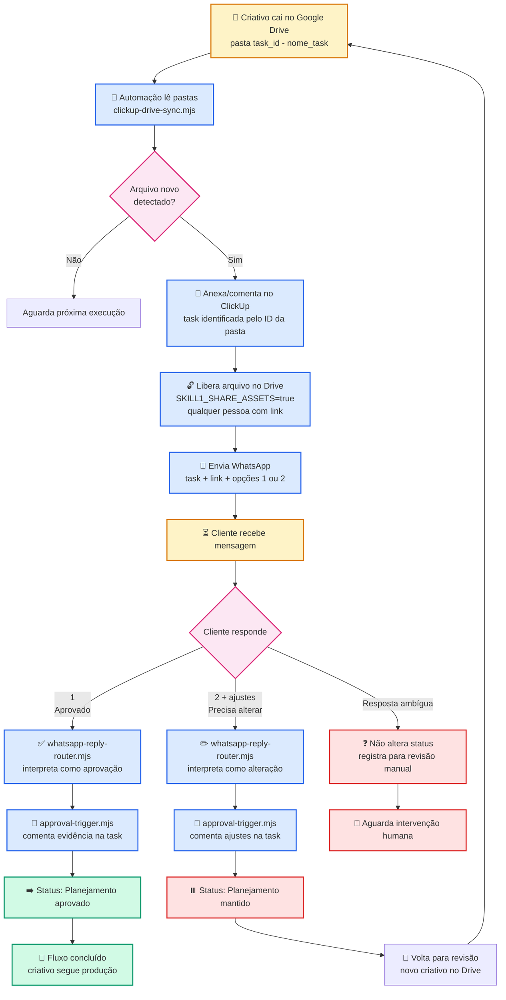
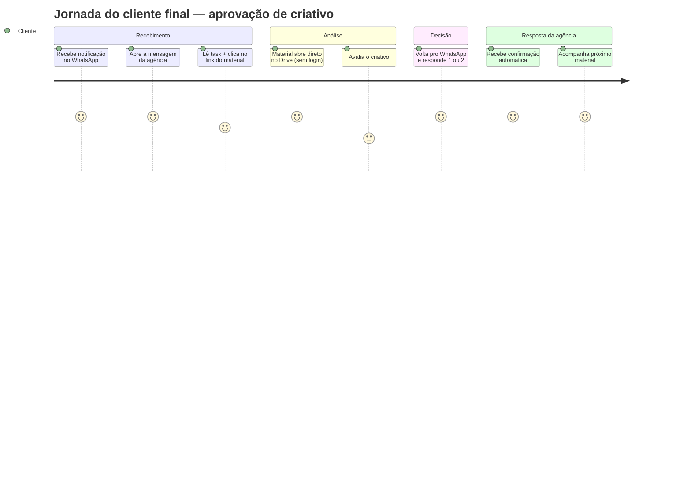
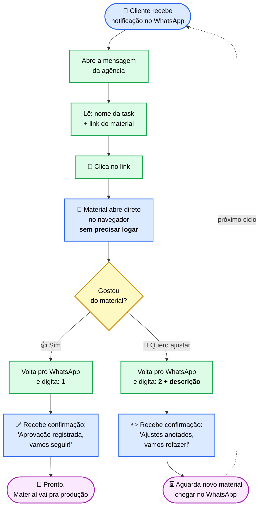

# Skill 1 — Automação de Aprovação de Criativos

> Fluxo **Drive → ClickUp → WhatsApp → Aprovação** sem Tally, sem formulário. A aprovação oficial fica registrada no ClickUp via **comentário + mudança de status**.

> [!success] Resumo em 1 linha
> Criativo cai no Drive → ClickUp recebe arquivo → WhatsApp pede aprovação → cliente responde `1` ou `2` → ClickUp atualiza comentário/status automaticamente.

---

## 1. Objetivo

Automatizar o fluxo de aprovação de criativos. Quando um criativo cair no Google Drive, a automação:

1. Identifica a task correta no ClickUp.
2. Anexa/comenta o criativo na task.
3. Libera o link do Drive para o cliente acessar.
4. Envia mensagem no WhatsApp pedindo aprovação.
5. Recebe a resposta do cliente.
6. Atualiza a task conforme a resposta.

---

## 2. Flowchart — visão executiva



---

## 2.1 Jornada do CLIENTE FINAL — o que ele vê

> [!tip] Esta é a versão para o Gustavo apresentar ao cliente dele
> O cliente final **não vê** Drive, ClickUp, scripts, status ou variáveis. Para ele, a experiência inteira acontece **dentro do WhatsApp**. Tudo o mais é invisível.

### 2.1.1 Linha do tempo do cliente



### 2.1.2 Fluxograma simplificado (perspectiva do cliente)



### 2.1.3 Como aparece no celular do cliente — mockup

**📱 Tela 1 — chega a notificação:**

```text
┌─────────────────────────────────────┐
│  WhatsApp                       🔔  │
├─────────────────────────────────────┤
│                                     │
│  🟢 Agência Bravo                   │
│  Olá! Segue o material para         │
│  aprovação...                       │
│                              14:32  │
│                                     │
└─────────────────────────────────────┘
```

**📱 Tela 2 — abre a conversa:**

```text
┌─────────────────────────────────────┐
│  ← Agência Bravo              📞 ⋮  │
├─────────────────────────────────────┤
│                                     │
│  ┌─────────────────────────────┐   │
│  │ Olá! Segue o material       │   │
│  │ para aprovação:             │   │
│  │                             │   │
│  │ Task: 86e1ch7n2 - Post      │   │
│  │ Instagram Black Friday      │   │
│  │                             │   │
│  │ 🔗 Arquivo:                 │   │
│  │ https://drive.google.com/...│   │
│  │                             │   │
│  │ Por favor, responda esta    │   │
│  │ mensagem com uma das        │   │
│  │ opções:                     │   │
│  │                             │   │
│  │ 1. Aprovado, pode seguir    │   │
│  │ 2. Precisa de alteração:    │   │
│  │    [descreva o ajuste]      │   │
│  │                             │   │
│  │ Se aprovado, vamos seguir   │   │
│  │ com o planejamento.         │   │
│  └────────────────────── 14:32 │   │
│                                     │
│  [💬 Digite uma mensagem...]    🎤  │
└─────────────────────────────────────┘
```

**📱 Tela 3a — cliente APROVA:**

```text
┌─────────────────────────────────────┐
│  ← Agência Bravo              📞 ⋮  │
├─────────────────────────────────────┤
│                                     │
│  ┌─────────────────────────────┐   │
│  │ [mensagem anterior...]      │   │
│  └────────────────────── 14:32 │   │
│                                     │
│              ┌────────────────────┐│
│              │  1                 ││
│              └──────────── 14:45 ✓✓│
│                                     │
│  ┌─────────────────────────────┐   │
│  │ ✅ Perfeito! Aprovação      │   │
│  │ registrada.                 │   │
│  │                             │   │
│  │ O material seguirá para     │   │
│  │ produção. 🚀                │   │
│  └────────────────────── 14:45 │   │
└─────────────────────────────────────┘
```

**📱 Tela 3b — cliente PEDE ALTERAÇÃO:**

```text
┌─────────────────────────────────────┐
│  ← Agência Bravo              📞 ⋮  │
├─────────────────────────────────────┤
│                                     │
│  ┌─────────────────────────────┐   │
│  │ [mensagem anterior...]      │   │
│  └────────────────────── 14:32 │   │
│                                     │
│       ┌──────────────────────────┐ │
│       │ 2 - Trocar o título      │ │
│       │ pra "Black Week" e       │ │
│       │ deixar o CTA em amarelo  │ │
│       └──────────────────  14:48 ✓✓│
│                                     │
│  ┌─────────────────────────────┐   │
│  │ ✏️ Anotamos os ajustes:     │   │
│  │ • Título: "Black Week"      │   │
│  │ • CTA: amarelo              │   │
│  │                             │   │
│  │ Vamos refazer e te mando    │   │
│  │ o novo material em breve!   │   │
│  └────────────────────── 14:48 │   │
└─────────────────────────────────────┘
```

### 2.1.4 O que o cliente **NÃO** precisa saber

| ❌ Cliente não vê | ✅ Cliente só vê |
|---|---|
| Google Drive (arquivo) | Link clicável no WhatsApp |
| ClickUp (task, status, comentário) | Confirmação no WhatsApp |
| Scripts da automação | Resposta instantânea |
| Variáveis de ambiente | "Material aprovado" / "Ajustes anotados" |
| Pastas com `task_id` | Nome humano da task |
| Sprint Board, Kanban | Conversa contínua no WhatsApp |

> [!success] Promessa de UX para o cliente final
> **"Você só precisa do WhatsApp. A gente cuida do resto."**
> Sem login. Sem app novo. Sem formulário. Sem perder tempo procurando link no email.

### 2.1.5 Argumentos de venda para o cliente final

1. **Zero fricção** — aprovação no app que ele já abre 50x por dia.
2. **Rastreabilidade total** — toda decisão fica gravada (a Bravo nunca mais "perde" um sim/não).
3. **Velocidade** — fluxo de aprovação cai de dias para minutos.
4. **Histórico organizado** — em vez de "lembra aquele post que aprovei mês passado?", existe um registro com data, hora e mensagem literal.
5. **Sem retrabalho de comunicação** — o cliente não precisa explicar duas vezes; o ajuste fica anexado ao material correto.

---

## 3. Regra principal de decisão

### Se cliente responder `1` → **Aprovado, pode seguir**

A automação faz:
- Comenta evidência na task (canal, telefone, data/hora, resposta literal).
- Move status: `Planejamento` → `Planejamento aprovado`.

### Se cliente responder `2` → **Precisa de alteração**

A automação faz:
- Comenta as ideias/ajustes do cliente na task.
- **Mantém** status em `Planejamento`.

---

## 4. Tabela de status no ClickUp

| Situação | Status final |
|---|---|
| Cliente ainda não aprovou | `Planejamento` |
| Cliente respondeu `1` | `Planejamento aprovado` |
| Cliente respondeu `2` | `Planejamento` (mantém) |
| Resposta ambígua | Não altera status (revisão manual) |

---

## 5. Organização no Drive

Cada task tem uma pasta própria no Drive seguindo o formato:

```text
<task_id> - <nome_da_task>
```

**Exemplo real:**

```text
86e1ch7n2 - Teste
```

Quando o arquivo cai nessa pasta, a automação sabe que ele pertence à task `86e1ch7n2`. **O ID da pasta = chave de roteamento.**

---

## 6. O que acontece quando o criativo cai no Drive

A automação executa em ordem:

1. Lê as pastas configuradas no Drive.
2. Encontra arquivos novos (compara contra state local).
3. Identifica a task pelo `task_id` no prefixo do nome da pasta.
4. Baixa/anexa o arquivo no ClickUp via API.
5. Comenta o link do Drive na task.
6. Prepara o disparo WhatsApp (template + link com permissão liberada).
7. Registra no state local para não reprocessar.

---

## 7. Mensagem enviada no WhatsApp

### Template

```text
Olá! Segue o material para aprovação:

Task: [task_id] - [nome_da_task]
Arquivo: [link_do_arquivo]

Por favor, responda esta mensagem com uma das opções:

1. Aprovado, pode seguir
2. Precisa de alteração: [descreva o ajuste]

Se aprovado, vamos seguir com o planejamento aprovado.
```

### Exemplo renderizado

```text
Olá! Segue o material para aprovação:

Task: 86e1ch7n2 - Teste
Arquivo: https://drive.google.com/file/d/...

Por favor, responda esta mensagem com uma das opções:

1. Aprovado, pode seguir
2. Precisa de alteração: [descreva o ajuste]

Se aprovado, vamos seguir com o planejamento aprovado.
```

---

## 8. Acesso ao arquivo no Drive

Para evitar a tela de *"pedir acesso"*, ativar a flag:

```env
SKILL1_SHARE_ASSETS_FOR_APPROVAL=true
```

Com isso, antes de mandar o WhatsApp, o arquivo é configurado como **"qualquer pessoa com o link pode visualizar"**.

> [!warning] Risco controlado
> Link é compartilhado apenas com o número WhatsApp do cliente registrado no ClickUp. Após aprovação, possível restringir novamente em fase 2.

---

## 9. Resposta do cliente — comentários gerados

### 9.1 Aprovação (`1`)

Cliente pode responder `1`, `Aprovado`, `Pode seguir`, `Ok aprovado`, etc.

**Comentário automático na task:**

```text
Aprovação recebida do cliente

Canal: WhatsApp
Cliente: [telefone]
Data: [data/hora]
Resposta:
"1"

Status movido para: planejamento aprovado
```

Status final: `planejamento aprovado`.

### 9.2 Alteração (`2`)

Cliente responde `2`, `Precisa alterar o texto`, `Trocar a imagem`, etc.

**Comentário automático na task:**

```text
Alterações solicitadas pelo cliente

Canal: WhatsApp
Cliente: [telefone]
Data: [data/hora]
Comentário:
"[mensagem literal do cliente]"

Status mantido em: Planejamento
```

Status final: `Planejamento` (sem mudança).

---

## 10. Scripts da automação

### 10.1 `clickup-drive-sync.mjs`

**Responsabilidade:** Drive → ClickUp → preparar WhatsApp.

Executa:
- Lê tasks abertas no ClickUp.
- Garante pasta correspondente no Drive.
- Detecta criativo novo.
- Anexa/comenta no ClickUp.
- Gera pedido de aprovação WhatsApp.

### 10.2 `whatsapp-reply-router.mjs`

**Responsabilidade:** Resposta WhatsApp → task correta.

Executa:
- Recebe número do cliente + mensagem.
- Encontra o último pedido de aprovação pendente para esse cliente.
- Interpreta `1` ou `2` (com fuzzy matching para variações).
- Chama o `approval-trigger.mjs`.

### 10.3 `approval-trigger.mjs`

**Responsabilidade:** Atualizar ClickUp.

Executa:
- Comenta evidência na task.
- Move para `planejamento aprovado` se aprovação.
- Mantém em `Planejamento` se alteração.

---

## 11. Variáveis de ambiente

```env
# Google Drive
GOOGLE_CLIENT_ID=
GOOGLE_CLIENT_SECRET=
GOOGLE_TOKEN=
GOOGLE_DRIVE_FOLDER_ID=

# ClickUp
CLICKUP_TOKEN=
CLICKUP_FIELD_PHONE=
CLICKUP_APPROVED_STATUS=planejamento aprovado

# Skill 1 — flags operacionais
SKILL1_SHARE_ASSETS_FOR_APPROVAL=true
SKILL1_MAX_WRITES_PER_RUN=10
SKILL1_DRY_RUN=false
```

> [!note] Onde estão os valores reais
> Credenciais reais em [[apis-credenciais]] (não comitado). `.env` local na VPS OpenClaw.

---

## 12. Resumo executivo (para o Gustavo)

```text
Drive caiu criativo
   ↓
ClickUp recebe arquivo
   ↓
WhatsApp envia aprovação
   ↓
cliente responde 1 ou 2
   ↓
ClickUp atualiza comentário/status
```

**Eliminamos:**
- ❌ Tally
- ❌ Formulário externo
- ❌ Aprovação fora do ClickUp

**Ganhamos:**
- ✅ Aprovação oficial registrada como evidência na task
- ✅ Status do projeto sempre reflete a realidade
- ✅ Cliente não precisa logar em nada — só WhatsApp
- ✅ Audit trail completo (quem, quando, o quê)

---

## 13. Próximos passos

- [ ] Validar status `planejamento aprovado` existe no ClickUp da Bravo
- [ ] Sign-off do Gustavo no fluxo (esta apresentação)
- [ ] Definir cliente-piloto para primeiro ciclo end-to-end
- [ ] Testar fuzzy matching de respostas ambíguas
- [ ] Documentar fallback quando WhatsApp não entrega (rate limit / número inválido)
