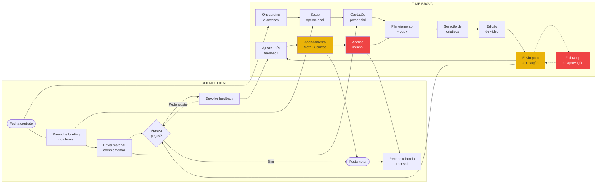
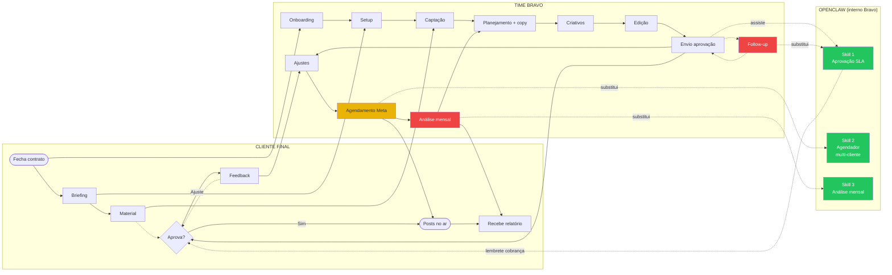

# BPMN Básico — Bravo Agency

> [!info] O que é
> Fluxo end-to-end da operação Bravo em **raias (swimlanes)**: o que é responsabilidade do **time interno** e o que depende do **cliente final**. Sem detalhamento de cada processo (esse vive em `[[processo-detalhado]]`) — aqui é só o esqueleto pra apresentação.

> [!warning] Reframe — leitura essencial
> Este documento foi reescrito após o discovery 25/04. Substitui versão anterior (que ainda usava skills antigas Análise/Planejamento/Copy e n8n no escopo). Skills validadas agora: **Aprovação SLA / Agendador multi-cliente / Análise mensal**. Camada técnica de automação interna: **OpenClaw + agentes + skills internas usadas pelo time da Bravo**. Não há n8n no escopo de entrega.

---

## 1. Ciclo de vida do cliente — visão de raias

### Legenda de cores

| Cor | Significado |
|-----|-------------|
| 🔴 Vermelho | Gargalo crítico (consome o sócio comercial) |
| 🟡 Amarelo | Atrito/atraso recorrente |
| ⚪ Branco | Processo fluindo |

### Pontos de atenção

- **Linhas pontilhadas** entre cliente e Bravo = handoffs onde o fluxo geralmente trava (espera de resposta, follow-up)
- **B8 (Follow-up)** e **B11 (Análise mensal)** estão em vermelho — são os processos que mais consomem o Gustavo
- **B10 (Agendamento)** e **B7 (Envio)** em amarelo — atrito repetitivo que Bravo resolve no esforço bruto

---

## 2. Onde a automação interna entra

> [!info] Camada técnica
> Automação **interna** via **OpenClaw + agentes + skills**. Usada pelo time da Bravo dentro do OpenClaw deles — não é integração externa com n8n. **Única exceção** que toca o cliente final: disparo de lembrete de cobrança de aprovação (mensagem programada).

### Como ler

| Linha | Significado |
|-------|-------------|
| `B7 -.assiste.-> O1` | OpenClaw apoia a etapa, time continua no controle |
| `B8 -.substitui.-> O1` | OpenClaw assume — time só valida |
| `O1 -.lembrete cobrança.-> C4` | Único ponto onde OpenClaw fala com cliente final (mensagem programada) |

### O que **não está** no escopo

- ❌ n8n / integrações externas
- ❌ Conectores diretos com Meta Business (agendamento real fica como roteiro/preparação, time executa)
- ❌ Bots de WhatsApp respondendo cliente
- ❌ Qualquer coisa que exija servidor/infra de produção pra o cliente final

> [!tip] Filosofia da entrega
> **Eloscope monta agentes e skills no OpenClaw da Bravo.** Time da Bravo opera essas skills no dia a dia. Quando algum dia a Bravo decidir vender skill pro cliente final dela, o caminho é "exportar" — mas isso **não é deste projeto**.

---

## 3. Tabela de raias resumida

| Etapa do ciclo | Quem inicia | Quem executa | Onde OpenClaw entra |
|----------------|-------------|--------------|----------------------|
| Onboarding | Cliente | Bravo | bônus de processo (Typeform unificado) |
| Captação | Bravo | Bravo (Gustavo + Ravi) | — |
| Planejamento + copy | Bravo | Bravo (Rafa + Content Machine) | — |
| Criativos | Bravo | Bravo (Rafa + Content Machine) | — |
| Edição | Bravo | Bravo (Editor) | — |
| Envio aprovação | Bravo | Bravo (Rafa) | apoio (Skill 1) |
| Follow-up aprovação | Bravo | Bravo (Gustavo) | **substitui (Skill 1)** + lembrete pro cliente |
| Ajustes | Cliente | Bravo (Designer/Editor) | — |
| Agendamento Meta | Bravo | Bravo (Ravi/Rafa) | **substitui (Skill 2)** |
| Análise mensal | Bravo | Bravo (Gustavo) | **substitui (Skill 3)** |

---

## 4. Próximos passos

1. **Apresentar pro time da Bravo** — material está em `[[fluxos-miro]]` pronto pra importar
2. **Validar reframe** das 3 skills com Gustavo
3. **Cronometrar análise mensal** real (input crítico pra Skill 3)

---

*Criado: 24/04/2026 · Reescrito: 27/04/2026 (reframe pós-discovery + ajuste OpenClaw como camada técnica)*
