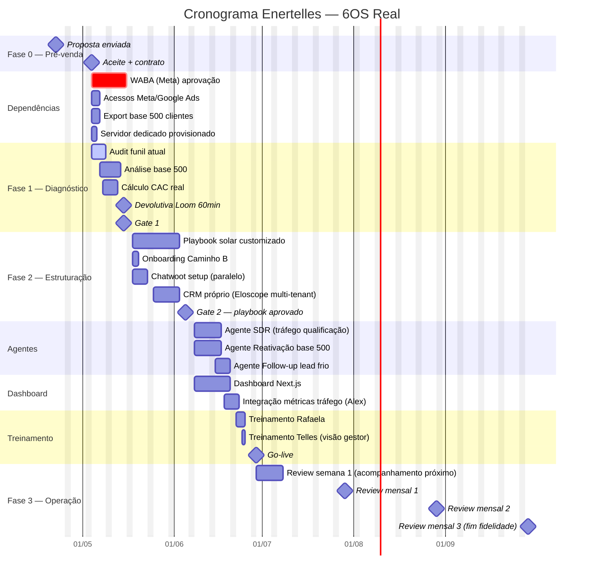

# Cronograma — Enertelles (6OS Real)

> **Versão:** 2.0 · **Caminho:** 🅾️ 6OS Real · **Kickoff alvo:** 2026-05-{TODO, após aceite}
> Substitui versão 0.1 (que previa Diagnóstico A → B). Após discovery no GDrive, escopo consolidado em Real direto.

## 1. Resumo executivo

- **Duração total (kickoff → operar):** 10 semanas (11 com buffer de WABA)
- **Gate 1 (fim da Fase 1 — Diagnóstico):** fim da semana 2 — você aprova o diagnóstico
- **Gate 2 (fim da Fase 2 — Playbook):** fim da semana 5 — você aprova o playbook antes de qualquer agente rodar
- **Primeiro marco de valor:** reativação da base 500 pode começar na semana 7 (antes do go-live final) — primeiras indicações chegando em ~S8

## 2. Gantt (Mermaid)

## 3. Tabela de marcos

| # | Marco | Data-alvo | Dias úteis | Dono Eloscope | Input do cliente | Critério de aceite |
|---|---|---|---|---|---|---|
| 1 | Contrato + acessos | S0 | 1d | Lucas | Meta Business, Google Ads, export CSV dos 500 clientes, senha do site | Todos os acessos confirmados |
| 2 | WABA approval (paralelo) | S0-S1 | 10d | Hugo | CNPJ + comprovante domínio | Aprovação Meta recebida |
| 3 | Fase 1 — audit funil | S1 | 5d | Lucas | Nada adicional | Planilha de funil + gargalos priorizados |
| 4 | Fase 1 — análise base 500 | S1-S2 | 5d | Lucas | CSV dos 500 + idade da instalação | Mapa de segmentação (idade, ticket, região) |
| 5 | Fase 1 — cálculo CAC real | S2 | 3d | Lucas + Alex | Dados de mídia do Alex | Planilha CAC diluído vs mídia |
| 6 | **Gate 1** — devolutiva Loom | **2026-05-15** | 0d | Lucas + Telles | Telles aprova em áudio/email | Audio ou email formal de aceite |
| 7 | Playbook solar customizado | S3-S5 | 12d | Lucas + Victor | Rafaela disponível 2h/semana pra input | Playbook PDF + 5 scripts de qualificação aprovados por Telles |
| 8 | Chatwoot + CRM | S3-S4 | 7d | Hugo | — | Chatwoot respondendo WABA; CRM com pipeline 6 etapas |
| 9 | **Gate 2** — playbook aprovado | **2026-06-05** | 0d | Telles | Aprovação formal do playbook | Aceite escrito — **sem isso, agente não roda** |
| 10 | Agente SDR (tráfego) | S6 | 7d | Hugo | — | Agente qualificando lead + passando pro humano |
| 11 | Agente Reativação base | S6 | 7d | Hugo | Lista 500 + roteiro aprovado | Campanha piloto em 50 clientes antigos ok |
| 12 | Agente Follow-up lead frio | S7 | 5d | Hugo | — | Sequência ativa pra lead "compra em 2 anos" |
| 13 | Dashboard Next.js | S6-S7 | 10d | Dédalo | — | Dashboard com métricas de 3 agentes + tráfego (Alex) |
| 14 | Treinamento Rafaela | S8 | 3d | Lucas | Rafaela disponível 3×1h | Rafaela operando solo com Chatwoot + CRM |
| 15 | Treinamento Telles (gestor) | S8 | 1d | Lucas | Telles 1h | Telles lendo dashboard sozinho |
| 16 | **Go-live 100%** | **2026-06-29** | 0d | Lucas | — | Todos os agentes autônomos |
| 17 | Review semana 1 pós go-live | S9 | diária | Lucas | — | 0 incidente crítico |
| 18 | Review mensal 1 | 2026-07-29 | 1h | Lucas | Telles + Alex | Ata + 3 ajustes priorizados |
| 19 | Review mensal 2 | 2026-08-29 | 1h | Lucas | Telles + Alex | Ata + métrica de meta |
| 20 | Review mensal 3 (fim fidelidade) | 2026-09-29 | 1h | Lucas | Telles + Alex | Decisão: renovar / ajustar escopo / encerrar |

## 4. Dependências críticas

| Dependência | Impacto se falhar | Mitigação |
|---|---|---|
| **WABA approval (10d)** | Sem isso, go-live atrasa. **Caminho crítico.** | Iniciar no D+0 paralelo ao Diagnóstico |
| **Export base 500 clientes** | Sem isso, agente de Reativação não roda — maior valor imediato | Pedir export já no kickoff. Se dados ruins, 2 dias extras de limpeza |
| **Gate 2 (playbook aprovado)** | **Regra invariante 6OS** — sem aceite formal do playbook, nenhum agente roda | Lucas entrega minuta em S4-1 pra Telles ter 1 semana pra revisar |
| **Rafaela disponível pra treinamento** | Se Rafaela não treinar, Chatwoot/CRM ficam ociosos | Confirmar agenda dela na semana 0 |
| **Alex na call de métricas** | Dashboard inútil se Alex não integrar métricas de tráfego | Alex participa da S7 (integração Métricas) |
| **Servidor dedicado provisionado** | Sem servidor, Chatwoot + CRM não rodam | Vercel + Supabase Pro provisionados no D+0, 2 dias |

## 5. Buffers e riscos

- **Buffer de 3 dias** entre fim da S4 e início dos agentes (S6) pra absorver revisão do playbook
- **WABA tem buffer de 2 dias** após os 10d úteis oficiais (Meta às vezes atrasa)
- **Risco alto:** Telles sumir (aconteceu em 2024-2025). Mitigação: Alex tem check-in semanal com ele; se 5 dias sem resposta em gate, escalação pra chamada de voz direta

## 6. Notas

- Reativação da base 500 **começa na S7** (antes do go-live total) — primeiras indicações esperadas em S8-S9. Isso dá prova-de-valor antes da Fase 3 começar formalmente.
- Case solar — **Loom de depoimento em S13** (após 2 meses operando) pra marketing Eloscope vertical solar.
- Se Telles quiser adicionar **site novo + SEO + blog** (conforme pediu no áudio 16/04): contrato acessório **separado** pós-go-live. Não entra no 6OS — regra invariante anti-software-house.
