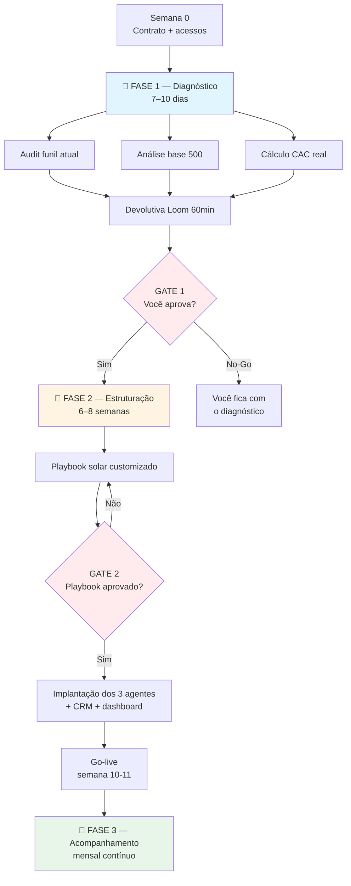

# Proposta Comercial 6OS — Enertelles (Telles / Thales)

> **Versão:** 2.0 (consolidada pós-descoberta GDrive 19/04/2026)
> **Supera orçamento antigo** (`GDrive doc 1QgQ...`) de R$ 12.000 setup + R$ 1.497/mês — aquele era pré-sprint 18/04 e misturava escopos. Esta versão está alinhada a 6OS v1.1 (Real).

---

**Preparada por:** Lucas Negreiro — Eloscope
**Para:** Telles / Thales, Enertelles (Catanduva + Atibaia)
**Intermediário:** Alex (parceiro Eloscope, gestor de tráfego da Enertelles)
**Data:** 2026-04-{TODO data alvo de envio}
**Validade:** 15 dias
**Contato:** eloscope.coo@gmail.com · WhatsApp Lucas

---

## 1. Contexto (o que a gente entendeu da sua operação)

A Enertelles opera energia solar há 5 anos em Catanduva e Atibaia, com equipe técnica própria (~10 pessoas, engenheiros + instalação + administrativo). 500 clientes instalados, ticket médio residencial R$ 17.000 e projetos grandes via network (R$ 100-500k). Comercial hoje roda com Rafaela no WhatsApp (atendimento, não vendas) e você, Telles, acumulando gestão + visita técnica + fechamento.

Descoberta central na nossa conversa com o Alex: você está em **modo sobrevivência** — 7 a 8 vendas/mês quando a estrutura suporta 20, e a meta declarada é exatamente 20.

> **Sua própria fala:** *"a gente tá com 7-8 e o que ajuda a gente a manter o negócio... mínimo 20 vendas mês"*

## 2. Onde o dinheiro está escapando (dor diagnosticada)

Três frentes, em ordem de tamanho:

**🔻 Gap da meta (R$ 204.000/mês)** — (20 − 8) × R$ 17k. Duas coisas travam: (a) 70% dos leads do tráfego param no topo sem ninguém qualificar, (b) 17 leads/mês chegam no fim de semana e esfriam até segunda.

**🔻 Base de 500 clientes inexplorada (R$ 170.000 imediato)** — 5 anos gerando clientes satisfeitos sem nenhum programa de pós-venda, indicação ativa, ou reativação. Conversão conservadora de 2% em indicação = 10 novas vendas × R$ 17k = R$ 170k em ~90 dias, sem custo de aquisição.

**🔻 CAC inflado (R$ 2.000 reportado vs R$ 250 de mídia)** — o gap (R$ 1.750) é custo do tempo seu e da Rafaela filtrando lead desqualificado. Isso é o que está consumindo sua capacidade.

**Total deixado na mesa em 12 meses:** ~R$ 2,4 mi de receita não realizada.

VPC solar completo: [Proposta_Valor_Template.md §vertical 2](../../templates/Proposta_Valor_Template.md#vpc-por-vertical-q2)

## 3. Proposta de valor

**Promessa-âncora (o compromisso que a gente assina):**

> "Em 10-12 semanas, Enertelles sai do modo sobrevivência: playbook comercial aprovado, 3 agentes IA operando (SDR de qualificação + follow-up de lead frio + reativação da base de 500), CRM próprio rodando e dashboard de métricas pra você e o Alex. Em 90 dias: **meta de 12-15 vendas/mês** (crescimento de 75-90%), com a base reativada gerando indicação contínua e o gargalo comercial destravado."

**Para o seu caso específico:**

- **Dor-âncora:** 500 clientes instalados que nunca voltaram à mesa + 70% de lead frio que ninguém trabalha
- **Valor entregue:** 3 agentes IA em frentes diferentes do funil + CRM próprio (não planilha) + dashboard pra gestão
- **Resultado esperado em 90 dias:** 
  - Reativação gera **5-10 vendas extras** no 1º trimestre (R$ 85-170k extra)
  - SDR de tráfego recupera **2-3 vendas/mês** dos 70% perdidos (R$ 34-51k/mês recorrente)
  - Rafaela para de triar lixo e foca em lead qualificado
  - Você recupera o tempo técnico pro projeto-ticket-alto (network Atibaia)

## 4. Caminho recomendado: 🅾️ 6OS Real

**Por que Real e não Beta:** seu escopo pede 3 agentes (SDR + Follow-up + Reativação) + servidor dedicado + dashboard + CRM próprio. Isso é operação de Real desde o discovery, não Beta. Além disso, 500 clientes + 2 polos + meta 150% crescimento precisam de infra dedicada, não compartilhada.

### 🅾️ 6OS Real — Escopo completo

| Dimensão | Entrega |
|---|---|
| **Fase 1 — Diagnóstico** | 10 dias. Mapa do funil, auditoria dos 500 da base, cálculo real do CAC, devolutiva Loom |
| **Fase 2 — Estruturação** | 8 semanas. Playbook solar customizado, 3 agentes (SDR/Follow-up/Reativação), integração WABA oficial, CRM próprio com pipeline 6 etapas, dashboard Next.js, treinamento Rafaela + Telles |
| **Fase 3 — Acompanhamento** | Mensal. Review com ajustes, relatórios semanais automatizados, tuning de playbook |
| **Stack dedicado** | Servidor dedicado de alta performance + n8n + OpenClaw + Supabase + WABA + Chatwoot omnichannel + dashboard Next.js |
| **Gates formais** | Gate 1 (fim Fase 1): você aprova o diagnóstico antes de implantar. Gate 2 (fim Fase 2): você aprova o playbook antes de qualquer agente rodar. |

### Investimento

| Item | Valor |
|---|---|
| **Setup (one-time, implantação completa)** | **R$ 6.000** |
| **Mensalidade (Acompanhamento + infra + agentes)** | **R$ 3.500/mês** |
| **Fidelidade mínima** | 3 meses |
| **Total primeiros 3 meses** | **R$ 16.500** |

**Comparativo com orçamento anterior (R$ 12k + R$ 1.497/mês):** o setup caiu porque v1.1 tem processo mais enxuto (sem retrabalho, playbook pré-validado em outros clientes). A mensalidade subiu porque inclui Fase 3 real (review mensal + tuning), não só infra.

> 👉 **Cálculo de payback:** com apenas **1 venda extra/mês** atribuída ao 6OS (de conservador R$ 85k já projetados da base), o payback é **no 1º mês**. ROI em 3 meses: 10-15x o investimento.

## 5. Processo de entrega

3 fases com **2 gates formais** — a regra é dura: **nada de automação antes do playbook aprovado por você**. Automatizar processo quebrado só escala o erro.

**Por fase (resumo):**
1. **Diagnóstico (semanas 1-2)** — 10 dias úteis. Saída: relatório + devolutiva Loom 60min + mapa do funil atual + análise segmentada dos 500 da base.
2. **Estruturação (semanas 3-10)** — 8 semanas. Saídas: playbook solar customizado (aprovado por você antes de qualquer IA), 3 agentes IA em produção (SDR + Follow-up + Reativação), CRM próprio, dashboard, Rafaela + você treinados.
3. **Acompanhamento (semana 11+)** — contínuo. Review mensal 60min + relatório semanal automático + tuning sempre que novo padrão surgir no funil.

Mapa fim-a-fim completo (entregáveis + donos + critérios de aceite): [Pacote_6OS_Q2.md §6](../../docs/Pacote_6OS_Q2.md#6-entregas-por-fase-público) e [Processo_Entrega_Template.md](../../templates/Processo_Entrega_Template.md).

## 6. Cronograma

Detalhe: [`./cronograma.md`](./cronograma.md).

Resumo:

| Semana | Marco |
|---|---|
| 0 | Contrato + acessos (Meta, Google Ads, base 500 clientes) |
| 1-2 | Fase 1 — Diagnóstico |
| 2 | Gate 1 + início Fase 2 |
| 3-5 | Playbook customizado + WABA approval (paralelo) |
| 5 | Gate 2 — você aprova o playbook |
| 6-9 | Deploy 3 agentes + CRM + dashboard + integração Chatwoot |
| 10 | Treinamento Rafaela + go-live |
| 11+ | Fase 3 operando + reativação base dispara |

## 7. Stack técnico

| Camada | Ferramenta |
|---|---|
| Canal cliente-final | WhatsApp Business API (oficial Meta) |
| Atendimento omnichannel | Chatwoot (instalado no seu servidor) |
| Automação | n8n self-hosted |
| Inteligência dos agentes | OpenClaw / OpenCloud |
| Persistência | Supabase Pro (Postgres + RLS + pgvector) |
| CRM | Eloscope multi-tenant (sua instância dedicada) |
| Dashboard | Next.js + Tailwind + shadcn + Clerk |
| Servidor | Dedicado de alta performance (Vercel + Supabase + nosso monitoring) |

Stack canônico completo (todas as camadas + obrigatoriedade): [Pacote_6OS_Q2.md §8](../../docs/Pacote_6OS_Q2.md#8--interno--stack-canônico-por-função)

## 8. Tempo por ferramenta (transparência)

| Frente | Setup (horas) | Operação/mês |
|---|---|---|
| Diagnóstico + análise base 500 | 30h | — |
| Playbook customizado solar | 40h | 3-5h tuning |
| Agente SDR (tráfego) | 30h | 4h |
| Agente Follow-up (lead frio 2 anos) | 20h | 3h |
| Agente Reativação (base 500) | 25h | 3h |
| CRM + dashboard | 50h | 5h |
| WABA + Chatwoot | 15h | 2h |
| Treinamento | 10h | — |
| Acompanhamento (review mensal + relatório) | — | 15-20h |

Tempos padrão por fase e por ferramenta (referência Q2): [Pacote_6OS_Q2.md §9](../../docs/Pacote_6OS_Q2.md#9--interno--tempos-horas-e-margem) · [Tempo_Template.md](../../templates/Tempo_Template.md)

## 9. Custos (transparência total)

### O que você paga pra Eloscope

| Item | Real |
|---|---|
| Setup | R$ 6.000 |
| Mensal | R$ 3.500 |
| Fidelidade | 3 meses |
| Total 3 meses | R$ 16.500 |

### Custos diretos que você paga (transparência)

| Item | Valor estimado |
|---|---|
| WhatsApp conversations (Meta) | R$ 300-1.500/mês (depende do volume) |
| Servidor dedicado (Vercel Pro + Supabase Pro) | R$ 300-400/mês |
| Clerk Auth (usuários do dashboard) | R$ 125/mês |
| Google Ads / Meta Ads | **mantém os R$ 2.000/mês atuais** — não aumentamos |
| **Total custos diretos estimados** | **R$ 700-2.000/mês** |

Tabela padrão de transparência de custos Q2: [Pacote_6OS_Q2.md §10](../../docs/Pacote_6OS_Q2.md#10-custos-e-transparência-ao-cliente-público)

## 10. Garantias / SLA

- **Diagnóstico:** se não considerar útil, devolvemos 50%. Funciona como produto próprio mesmo se não virar Real.
- **Operação:** agentes rodam em produção com supervisão na 1ª semana. Autonomia plena só depois do seu time validar.
- **Acompanhamento:** review mensal 60min + relatório semanal **automatizado**.
- **Anti-lock-in:** seu playbook, workflows n8n e dados saem com você se encerrar contrato. Sem refém.
- **LGPD:** DPA padrão (seus clientes são pessoas físicas — relevante). RLS multi-tenant no Supabase. Guardrails de PII nos agentes.
- **Case solar:** como é nosso primeiro case vertical solar, há contrapartida de depoimento + uso de marca em troca (opcional — você aceita ou não).

## 11. Objeções antecipadas (já pra encarar)

**1. "Ciclo da solar é longo demais pra 3 meses de contrato"**
Justamente. O agente de follow-up existe pra segurar o lead que vai comprar daqui 1-2 anos (conforme você disse ao Alex) — sem isso, você perde. 3 meses é o tempo mínimo pra ver a reativação da base 500 rodar + primeira onda de tráfego qualificado entrar em visita técnica.

**2. "A Black Scale cobra R$ 1.500 + R$ 800, 4x mais barato — 250 páginas + IA + dashboard"**
O diagnóstico deles tem pontos corretos: split de funil B2B/B2C, pivot pra Agro, reativação de base. A gente concorda com o "Gigante Disfarçado". A diferença é **como executa**. Três problemas sérios no pacote deles:

- **250 páginas "Mass Page SEO" = Doorway Pages.** Google tem política explícita contra isso desde 2015 (atualizada 2023). Consequências documentadas: rebaixamento manual do domínio, ou banimento completo. **O `enertelles.com.br` hoje tem autoridade — se ele for punido, você perde anos de ranking orgânico.** Cases públicos: CNET removido do Google News em 2024 por AI content em escala, HubSpot perdeu 80% do tráfego orgânico out/2024 por programmatic SEO.
- **"Blindagem de Reputação" = filtro de reviews = violação das políticas do Google Business Profile.** Consequência: suspensão do perfil. Seu GMB hoje é um ativo que gera indicação orgânica — reconstruir leva 6-12 meses após suspensão. Risco não compensa economia.
- **Preço incongruente:** R$ 1.500 setup não paga 1 dia de dev especializado pra configurar IA + 250 páginas + campanhas + integração WhatsApp. Na prática, ou é IA gerando lixo em massa sem revisão humana, ou template pronto reusado. Nosso R$ 6.000 setup cobre 220h de equipe especializada (dev + estrategista + treinamento + playbook).

**Nossa execução:** SEO whitehat + GEO (Generative Engine Optimization — otimizamos pra aparecer no ChatGPT, Perplexity, Claude). Reviews éticos (processo pós-venda que convida, não filtra). Playbook solar customizado, não template. É menos "quantidade" e mais "ativo protegido".

*Se você quiser testar o outro pelo preço, respeito. Te peço só uma coisa: me avisa em 4 meses como foi — sem cobrança.*

**3. "Já paguei o Botconversa no passado e não funcionou"**
Botconversa é bot com flow rígido (if-then-else). Aqui é IA com contexto (LLM) — ela **adapta** a conversa, responde fora do script, entende áudio. Diferença prática: bot perde lead em 3 perguntas, IA conduz até agendamento. Posso te mostrar um agente nosso rodando ao vivo na próxima call.

**4. "IA é impessoal, meu cliente vai perceber e desistir"**
Nossas IAs ganham nome e rosto (uma nossa se chama Luna). Ela se apresenta como atendente humanizada. Conduz por áudio quando convém. **Não fecha venda** — qualifica e passa pro humano no momento certo. Seu cliente percebe que está conversando com alguém; a IA pede a conta de luz, responde dúvida básica e agenda visita. Quem fecha é você.

**5. "Meu diferencial é técnico/autoridade — IA não representa isso"**
Sua autoridade técnica + equipe de engenharia própria é o que fecha projeto de R$ 500k via network. O 6OS **não toca essa camada**. Ele destrava a camada de baixo (R$ 15-17k residencial) pra você ter caixa e tempo pra trabalhar a camada alta. Autoridade segue sendo sua.

**6. "O orçamento anterior era R$ 12k + R$ 1.497 — e agora é diferente?"**
Aquela proposta é de antes da nossa última revisão interna. Enxugamos a metodologia, o setup ficou mais barato (R$ 6k em vez de R$ 12k), e a mensalidade subiu (R$ 3.500 em vez de R$ 1.497) porque agora inclui **acompanhamento mensal real** (review + tuning), que na v anterior ia como extra. No total dos 3 meses, é essencialmente o mesmo investimento — e o escopo entrega mais.

Matriz completa: [Objecoes_Matriz_Template.md](../../templates/Objecoes_Matriz_Template.md)

## 12. Próximos passos

- [ ] Ler esta proposta + olhar cronograma anexo
- [ ] Marcar call de 45min com Alex + Lucas pra dúvidas (demo da Luna ao vivo + apresentação do CRM)
- [ ] Decisão: vamos com o 6OS Real?
- [ ] Assinatura de contrato (Clicksign — link após aceite)
- [ ] Pagamento do setup (à vista ou 3x)
- [ ] Kickoff agendado em até 5 dias úteis pós-pagamento

**Proposta válida por 15 dias. Caso queira ajustar escopo (ex: começar sem dashboard 7D e upgrade depois), respondemos no mesmo dia.**

---

### Referência interna — fonte-da-verdade

Esta proposta referencia **[Pacote_6OS_Q2.md](../../docs/Pacote_6OS_Q2.md)** como fonte-da-verdade pros blocos genéricos Q2 (processo, stack, tempos, custos padrão). Customizações específicas da Enertelles (cálculo de gap R$ 2,4mi, 3 agentes específicos, narrativa "modo sobrevivência", objeções ativas da call) ficam só aqui.

Se o Pacote atualizar, esta proposta continua válida — mas os links apontam pra versão atualizada. Auditar antes de enviar: ler Pacote §3/5/6/7/10 pra garantir que o range de preço e cronograma aqui ainda batem com a fonte-da-verdade.

### Notas internas (REMOVER antes de enviar)

- **Alex precisa estar na call de apresentação.** Ele é a ponte. Enviar pra Alex primeiro, validar com ele, depois os dois mandam pro Telles.
- **Evitar linguagem técnica pesada** — Telles é engenheiro mas tem "trava comercial" (palavras do Lucas no Fireflies). Falar de **dinheiro deixado na mesa** e de **recuperar tempo técnico dele** pra ticket alto.
- **Ancorar no cálculo R$ 170k da base** antes de qualquer conversa sobre IA. É a âncora-de-valor mais imediata.
- **Não começar pela IA** — começar pelo playbook/processo. Telles reconhece que é desorganizado ("muito bagunçado... muitas crenças").
- **Split/comissão com Alex** — alinhar antes (5-10% recorrente?) pra ele ter incentivo de fechar.
- **Se Telles objetar o preço:** reduzir pra Beta enxuto (R$ 3k setup + R$ 1.500/mês) tirando dashboard + Chatwoot + 2 dos 3 agentes. Mas avisar que restringe a reativação (o maior valor imediato). **Alternativa tática:** oferecer Diagnóstico standalone (R$ 2.500, 10 dias) como trampolim pro Real — protege a relação e dá prova da metodologia sem compromisso grande.
- **PDF do concorrente lido** (análise completa em `meeting-notes/concorrente-blackscale.md`). Concorrente é Black Scale Intelligence / Rodrigo Meireles. Preço R$ 1.500 + R$ 800. Três red flags: 250 páginas doorway / filtro reviews viola GMB / preço incongruente. **Na call, reconhecer o que é bom no diagnóstico deles** ("Gigante Disfarçado" é verdade) **antes** de apontar as armadilhas técnicas — senão parece ressentimento, não proteção.
- **Briefing com Alex antes da call de apresentação:** ele precisa saber os 3 red flags pra responder se Telles trouxer a comparação sem Lucas na sala.
