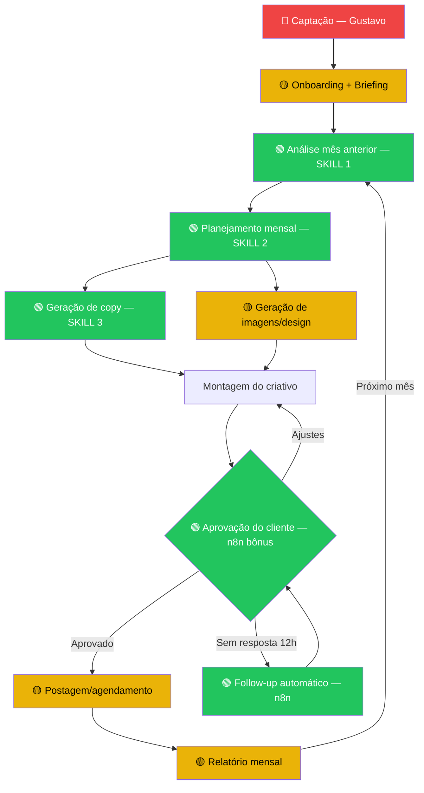

# Framework de Mapeamento e Priorização de Processos

> **Projeto:** Bravo Agency
> **Método:** Process Assessment Matrix + Automation Score
> **Baseado em:** Value Stream Mapping (Lean) + RPA Opportunity Assessment
> **Pré-preenchido:** com dados da reunião de 20/04/2026 (73min) — validar no discovery 26/04

---

## 0. Contexto Operacional Extraído

### Equipe atual

| Pessoa | Função | Dedicação estimada |
|--------|--------|--------------------|
| Gustavo | Sócio — comercial + gestão + operacional ("faz de tudo") | 100% (sobrecarregado) |
| Rafael (Design) | Design da agência — criativos, layouts | ~80% design, ~20% outros |
| Javi | Multifunção ("Severino") — copy, operacional, suporte | 100% operacional |
| Rafael (Editor) | Edição de vídeo | dedicação parcial |

**Contexto:** Equipe encolheu de 7 para 4 pessoas. Não há processo definido — equipe cresceu sem estruturação.

### Números-chave

| Dado | Valor | Fonte |
|------|-------|-------|
| Clientes ativos | 20 | Gustavo (reunião) |
| Ticket atual | ~R$1.200/mês | Gustavo (reunião) |
| Ticket alvo | R$1.300–2.000/mês | Gustavo (reunião) |
| Serviços | Conteúdo + LP (novo) + Tráfego (Meta+Google) | Gustavo (reunião) |
| Cliente ideal alvo | Serviço, fatura R$25k+/mês | Gustavo (reunião) |
| Parceiro | Google Meu Negócio (terceirizado) | Gustavo (reunião) |

### Ferramentas em uso

| Ferramenta | Uso |
|------------|-----|
| ChatGPT (assinatura) | Análise de cliente, copy |
| Claude (plano Pro ~R$92) | Análise, copy, geral |
| Canva | Design de criativos |
| ClickUp | Gestão de tarefas (plano free) |
| IOX/Squads (R$66) | 136 agentes comprados, ainda não operacional |
| Lovable | Landing pages (novo) |
| WhatsApp | Comunicação com cliente |

### Dores identificadas (da transcrição)

1. **Sem processo definido** — "não tinha um processo definido" (cresceu para 7, encolheu)
2. **Gustavo 100% operacional** — "estou meio que fazendo de tudo aqui também"
3. **Alto consumo de tokens** — cada cliente tem particularidades
4. **Aprovação do cliente demora** — precisa cobrar resposta 6-12h
5. **Design manual** — Rafael procura imagens, cria do zero (quer que IA traga e ele ajuste)
6. **Escalabilidade** — quer aumentar clientes sem inchar equipe

---

## 1. Mapeamento de Atividades

Para cada etapa do processo, capturar:

### Template por Atividade (usar no discovery para atividades novas)

```
ATIVIDADE: [nome]
MÓDULO: [captação | onboarding | estratégia | planejamento | copy | design | aprovação | postagem | relatório]

Quem faz:        [ ] Gustavo  [ ] Rafael  [ ] Javi  [ ] Cliente  [ ] Ferramenta
Frequência:      [ ] 1x/cliente  [ ] Mensal  [ ] Semanal  [ ] Diário  [ ] Por demanda
Tempo médio:     ___ min/vez
Volume mensal:   ___ vezes/mês (x20 clientes = ___ total)
Tempo total/mês: ___ horas

Ferramenta atual:  [ ] Manual  [ ] ChatGPT  [ ] Canva  [ ] ClickUp  [ ] WhatsApp  [ ] Outro: ___
Tipo:              [ ] Criativo  [ ] Analítico  [ ] Comunicação  [ ] Operacional

Input:   ___
Output:  ___
Depende de: [atividade anterior]
Bloqueia: [atividade seguinte]

Dor principal: ___
```

---

## 2. Dimensões de Avaliação (Score 1-5)

Cada atividade recebe nota em 6 dimensões. Escala calibrada para o contexto Bravo (agência de conteúdo, 20 clientes, 4 pessoas):

| Dimensão | 1 (baixo) | 3 (médio) | 5 (alto) | Peso |
|----------|-----------|-----------|----------|------|
| **Tempo** — quanto tempo consome por execução | <10min | 20-40min | >1h | 1× |
| **Volume** — frequência × base de clientes | <5×/mês | 10-20×/mês | 20+ ou por post (160+) | 1× |
| **Repetitividade** — o processo é padronizável? | Cada cliente é único | Template com ajustes por nicho | Sempre o mesmo fluxo | 1× |
| **Impacto** — o que libera se automatizar? | Pouco tempo/pouca dor | Tempo moderado OU dor alta | Horas do Gustavo + escala | 1× |
| **Viabilidade IA** — IA resolve hoje? | Precisa julgamento criativo forte | IA faz 70%, humano ajusta tom/estilo | IA faz 90%+, humano valida | 1× |
| **Custo Atual** — custo de pessoa + ferramenta | Operacional baixo (estagiário faz) | Pessoa qualificada + tempo moderado | Sócio fazendo (custo de oportunidade alto) | 1× |

> **Refinamento para Bravo:** A dimensão "Custo Atual" pondera custo de oportunidade — quando é o Gustavo fazendo algo operacional, o custo é alto porque ele deveria estar vendendo (hora dele = R$100+/h estimado). Isso reflete a dor principal: Gustavo preso na operação.

### Score de Prioridade

```
Score = (Tempo + Volume + Repetitividade + Impacto + Viabilidade + Custo Atual) / 6
```

| Score | Prioridade | Ação | Prazo no projeto |
|-------|-----------|------|-----------------|
| 4.0 — 5.0 | AUTOMATIZAR PRIMEIRO | Skill prioritária | Semana 2-3 (entrega Bravo) |
| 3.0 — 3.9 | AUTOMATIZAR DEPOIS | Próxima fase ou bônus | Fase 2 (proposta futura) |
| 2.0 — 2.9 | ASSISTIR COM IA | IA ajuda, humano lidera | Treinamento + prompt library |
| 1.0 — 1.9 | MANTER MANUAL | Não compensa automatizar | Fora de escopo |

---

## 3. Matriz de Processos da Bravo

> **Legenda:** Scores pré-estimados com base na reunião 20/04. Validar no discovery 26/04.
> T=Tempo | V=Volume | R=Repetitividade | I=Impacto | Vi=Viabilidade IA | C=Custo Atual

### Fluxo mensal por cliente (core)

| # | Atividade | Módulo | Quem | Tempo/vez | Vol/mês | Ferramenta | T | V | R | I | Vi | C | Score | Prioridade |
|---|-----------|--------|------|-----------|---------|------------|---|---|---|---|----|----|-------|-----------|
| 1 | Prospecção e fechamento | captação | Gustavo | ~60min? | ~4? | Manual/WhatsApp | 3 | 2 | 2 | 3 | 2 | 3 | **2.5** | ASSISTIR |
| 2 | Briefing inicial (paleta, logo, estilo, nicho) | onboarding | Gustavo+Javi | ~90min? | ~2? | ChatGPT/Claude | 3 | 2 | 3 | 3 | 4 | 3 | **3.0** | AUTOMATIZAR DEPOIS |
| 3 | Setup IA do cliente (jogar dados na IA) | onboarding | Javi | ~60min? | ~2? | Claude/ChatGPT | 3 | 2 | 4 | 4 | 5 | 3 | **3.5** | AUTOMATIZAR DEPOIS |
| 4 | Análise do mês anterior (métricas, posts, engajamento) | estratégia | Gustavo | ~45min? | 20 (1×cliente) | ChatGPT/Claude | 3 | 5 | 4 | 4 | 5 | 4 | **4.2** | AUTOMATIZAR 1o |
| 5 | Planejamento mensal (calendário de posts) | planejamento | Gustavo+IA | ~30min? | 20 (1×cliente) | ChatGPT/Claude | 2 | 5 | 4 | 5 | 5 | 4 | **4.2** | AUTOMATIZAR 1o |
| 6 | Envio do plano + cobrança de aprovação | aprovação | Gustavo/Javi | ~10min + espera | 20 + follow-ups | WhatsApp | 2 | 5 | 5 | 4 | 5 | 3 | **4.0** | AUTOMATIZAR 1o |
| 7 | Geração de copy (textos carrossel, posts) | copy | Javi+IA | ~20min? | 20×~8posts = 160? | ChatGPT/Claude | 2 | 5 | 4 | 4 | 5 | 4 | **4.0** | AUTOMATIZAR 1o |
| 8 | Geração de imagens/criativos | design | Rafael | ~30min? | 20×~8 = 160? | Canva + IA | 3 | 5 | 3 | 4 | 4 | 4 | **3.8** | AUTOMATIZAR DEPOIS |
| 9 | Ajuste fino de criativos (paleta, identidade) | design | Rafael | ~15min? | 20×~8 = 160? | Canva | 2 | 5 | 3 | 3 | 3 | 3 | **3.2** | ASSISTIR |
| 10 | Aprovação de criativos pelo cliente | aprovação | Gustavo/Javi | ~10min + espera | 20 + follow-ups | WhatsApp | 2 | 5 | 5 | 3 | 5 | 3 | **3.8** | AUTOMATIZAR DEPOIS |
| 11 | Postagem/agendamento | postagem | Javi? | ~10min? | 20×~8 = 160? | Manual? | 1 | 5 | 5 | 3 | 5 | 3 | **3.7** | AUTOMATIZAR DEPOIS |
| 12 | Relatório mensal (prestação de serviço) | relatório | Gustavo? | ~30min? | 20 (1×cliente) | Manual? | 2 | 5 | 4 | 3 | 5 | 3 | **3.7** | AUTOMATIZAR DEPOIS |
| 13 | Edição de vídeo | design | Rafael Editor | ~60min? | variável | Software edição | 3 | 3 | 2 | 3 | 2 | 3 | **2.7** | ASSISTIR |
| 14 | Gestão de tráfego (Meta+Google) | tráfego | Gustavo? | ~30min? | 20? | Meta Ads/Google | 2 | 5 | 3 | 4 | 3 | 4 | **3.5** | AUTOMATIZAR DEPOIS |
| 15 | Criação de Landing Page | LP | Javi/Rafael? | ~3h? | ~2? | Lovable | 4 | 1 | 3 | 3 | 4 | 3 | **3.0** | ASSISTIR |

> **?** = estimativa a validar no discovery. Perguntar tempo real e volume exato.

### Ranking por Score (pré-estimado)

| Pos | Atividade | Score | Candidata a Skill? |
|-----|-----------|-------|--------------------|
| 1 | Análise do mês anterior | **4.2** | SIM — Skill 1 |
| 2 | Planejamento mensal | **4.2** | SIM — Skill 2 |
| 3 | Envio do plano + cobrança | **4.0** | SIM — Skill 3 (via n8n) |
| 4 | Geração de copy | **4.0** | EMPATE — forte candidata |
| 5 | Aprovação de criativos | **3.8** | Backlog fase 2 |
| 6 | Geração de imagens | **3.8** | Backlog fase 2 |
| 7 | Postagem/agendamento | **3.7** | Backlog fase 2 |
| 8 | Relatório mensal | **3.7** | Backlog fase 2 |

> **Nota sobre empate #3/#4:** Copy (4.0) e Cobrança de aprovação (4.0) empatam. Desempate por:
> - **Sequência lógica:** Análise → Planejamento → Copy faz mais sentido (fluxo contínuo)
> - **Quick win:** Cobrança de aprovação é mais rápida de implementar (n8n + WhatsApp)
> - **Dor do Gustavo:** "Cada 6-12h cobrar o cliente" — dor explícita
>
> **Recomendação pré-discovery:** Skill 3 = Copy generation (mais valor), mas cobrança automática pode entrar como bônus via n8n. Validar com Gustavo.

---

## 4. Análise de Custo por Processo

> **Pré-estimado.** Validar custos reais no discovery (perguntar salários/pró-labore/custos fixos).

### Custo-hora estimado da Bravo

**Premissas para estimar (validar com Gustavo):**
- Receita mensal: 20 clientes × R$1.200 = R$24.000 bruto
- Horas produtivas/mês por pessoa: ~160h (8h × 20 dias úteis)
- Total horas equipe: 4 pessoas × 160h = 640h disponíveis

| Pessoa | Custo estimado/hora | Baseado em | Validar |
|--------|-------------------|------------|---------|
| Gustavo (sócio) | R$80-120/h | Pró-labore + custo de oportunidade — comercial vale mais | Quanto tira de pró-labore? |
| Rafael (design) | R$40-60/h | Salário estimado ~R$3k-4k + encargos | Salário real? CLT/PJ? |
| Javi (multifunção) | R$40-60/h | Salário estimado ~R$3k-4k + encargos | Salário real? CLT/PJ? |
| Rafael Editor (vídeo) | R$30-50/h | Dedicação parcial, provavelmente freelancer | Fixo ou por job? |

### Custos fixos mensais (estimar no discovery)

| Item | Valor estimado | Validar |
|------|---------------|---------|
| Folha (4 pessoas) | R$12k-16k? | Perguntar |
| Ferramentas (ChatGPT+Claude+Canva+ClickUp) | ~R$500-800? | Claude R$92 + ChatGPT ~R$100 + Canva ~R$55 |
| Espaço/infraestrutura | ? | Trabalham juntos presencial? Home office? |
| Impostos | ? | Simples? MEI? |
| **Total fixo estimado** | **R$15k-20k?** | |

```
Custo-hora real = Total custos fixos ÷ Total horas produtivas
Exemplo: R$18.000 ÷ 640h = R$28/h (média ponderada)
```

### Custo mensal por atividade (top 6 processos)

```
Custo/atividade = (tempo/vez × volume/mês) × custo-hora da pessoa
```

| Atividade | Tempo/vez | Vol/mês | Quem | Custo-hora | Custo/mês | % do total |
|-----------|-----------|---------|------|-----------|-----------|-----------|
| Análise mês anterior | ~45min | 20 | Gustavo (R$100/h) | R$100 | R$1.500 | ? |
| Planejamento mensal | ~30min | 20 | Gustavo (R$100/h) | R$100 | R$1.000 | ? |
| Geração de copy | ~20min | 160 | Javi (R$50/h) | R$50 | R$2.667 | ? |
| Design/criativos | ~30min | 160 | Rafael (R$50/h) | R$50 | R$4.000 | ? |
| Aprovação (envio+follow-up) | ~15min | 40 | Gustavo (R$100/h) | R$100 | R$1.000 | ? |
| Relatório mensal | ~30min | 20 | Gustavo (R$100/h) | R$100 | R$1.000 | ? |

**Total custo operacional estimado (top 6):** ~R$11.167/mês
*(provavelmente subestimado — validar tempos reais no discovery)*

### Custo com automação (projeção pós-skills)

| Atividade | Custo IA/vez | Vol/mês | Custo IA/mês | Economia vs. manual |
|-----------|-------------|---------|-------------|-------------------|
| Análise mês anterior | ~R$2 (tokens) | 20 | R$40 | R$1.460 (97%) |
| Planejamento mensal | ~R$1 (tokens) | 20 | R$20 | R$980 (98%) |
| Geração de copy | ~R$0.50 | 160 | R$80 | R$2.587 (97%) |
| Cobrança aprovação (n8n) | ~R$0 | 40 | ~R$0 | R$1.000 (100%) |

**Total custo com IA/mês (4 processos):** ~R$140
**Economia mensal estimada:** ~R$6.027
**Economia em horas de Gustavo:** ~35-40h/mês (libera para comercial)

> **Argumento de venda para o discovery:** O projeto de R$3.900 se paga em menos de 1 mês só em economia de hora do Gustavo.

---

## 5. Mapa de Dependências

### Fluxo mensal por cliente (com classificação de automação)



### Legenda

```
🟢 Verde  = Automatizado neste projeto (Skills 1-3 + n8n)
🟡 Amarelo = Assistido (IA ajuda, humano lidera) — fase 2
🔴 Vermelho = Manual (requer Gustavo) — fora do escopo
```

### Insight do fluxo

O ciclo mensal `Análise → Planejamento → Copy → Aprovação` é onde estão os 3 maiores scores E onde Gustavo mais gasta tempo. Automatizar esse trecho libera ~25-35h/mês dele para vender — exatamente o que ele precisa para escalar de 20 para 30+ clientes sem contratar.

---

## 6. Decisão: Quais 3 Skills?

Após o scoring, as 3 atividades com maior score viram as 3 skills do projeto.

### Critérios de desempate

1. **Sequência lógica** — preferir skills que se conectam (ex: análise → planejamento faz mais sentido que análise → postagem)
2. **Quick win** — se duas têm score igual, priorizar a mais rápida de implementar
3. **Dor do Gustavo** — o que ele mais reclama pesa no desempate

### Resultado pré-estimado (validar no discovery)

| Posição | Atividade | Score | Justificativa |
|---------|-----------|-------|--------------|
| Skill 1 | **Análise mensal do cliente** | 4.2 | Maior score. IA lê métricas + posts anteriores + briefing do cliente e gera dossiê. Gustavo gasta ~15h/mês nisso. Viabilidade IA altíssima. |
| Skill 2 | **Planejamento mensal de conteúdo** | 4.2 | Conecta direto com Skill 1 (sequência lógica). IA gera calendário editorial com base no dossiê. Gustavo gasta ~10h/mês. |
| Skill 3 | **Geração de copy** | 4.0 | Maior volume (160 peças/mês). Javi já usa ChatGPT/Claude — skill estruturada melhora qualidade e velocidade. Libera Javi para outras tarefas. |
| Bônus | Cobrança automática de aprovação (n8n) | 4.0 | Quick win — implementar junto como bônus. n8n + WhatsApp. Dor explícita do Gustavo ("cobrar cada 6-12h"). |
| Backlog | Geração de criativos/imagens | 3.8 | Fase 2 — depende de Rafael testar IA gerando imagens |
| Backlog | Relatório mensal automático | 3.7 | Fase 2 — fácil mas menos impacto |
| Backlog | Postagem automatizada | 3.7 | Fase 2 — precisa integração com plataformas |

> **Narrativa para o discovery:** "Vamos começar automatizando o ciclo que mais consome seu tempo: analisar → planejar → escrever. Todo mês, em vez de você gastar 25h+ fazendo isso para 20 clientes, a IA faz o rascunho e você só valida. Sobram ~25h/mês para vender."

---

## 7. Roteiro de Perguntas por Módulo

> ✅ = já sabemos da reunião 20/04. Focar no discovery nas perguntas abertas.

### Captação
- ✅ Gustavo faz sozinho. Sem processo definido.
- Como o cliente te encontra hoje? (indicação? tráfego próprio? cold?)
- **Quanto tempo entre primeiro contato e fechamento?** ← validar
- Tem proposta padrão ou faz sob medida? (mencionou "método" novo)

### Onboarding
- ✅ Briefing inicial: paleta, logo, estilo, nicho. Joga tudo na IA.
- **Tem formulário ou é por conversa?** ← validar
- **Quanto tempo leva o onboarding completo?** ← validar (estimei 90min)
- O que mais atrasa nessa fase?
- **Quais acessos pede?** (Instagram, Meta Ads, Google Ads, Analytics?)

### Estratégia / Análise
- ✅ Gustavo + IA analisam mês anterior. Quer automatizar pro dia 1.
- **Me mostra como você faz a análise hoje** — abre o ChatGPT/Claude e mostra
- Quanto tempo leva pra analisar 1 cliente? ← validar (estimei 45min)
- **Quais métricas olha?** (engajamento? seguidores? leads? vendas do cliente?)
- O cliente manda feedback/input pro mês seguinte? Como?

### Planejamento
- ✅ Quer gerar plano automaticamente com base na análise
- **Quantos posts/mês por cliente?** ← número exato
- **Tem calendário editorial?** Ou é semana a semana?
- Quanto tempo leva montar 1 plano? ← validar (estimei 30min)

### Copy
- ✅ Javi + IA (ChatGPT/Claude). Já tem .md com prompt de carrossel.
- **Me mostra como gera copy hoje** — abre a ferramenta e mostra
- **Quanto tempo por texto?** ← número exato
- Tem padrão de tom/estilo por cliente? Onde fica documentado?
- ×20 clientes × ?posts = quanto tempo total/mês?

### Design
- ✅ Rafael. Quer que IA traga imagens e ele ajuste à paleta.
- **Rafael, me mostra como tu faz um post do zero** ← demonstração ao vivo
- **Quanto tempo por peça?** ← número exato
- Usa templates no Canva ou faz do zero cada vez?
- Quantas peças por cliente por mês?

### Aprovação
- ✅ WhatsApp. Cobra cada 6-12h. Máximo 24-48h.
- **Quantas rodadas de ajuste em média?** ← validar
- Já usou alguma ferramenta de aprovação? (ou sempre WhatsApp?)
- O que mais atrasa aqui? (resposta do cliente? ou ajustes internos?)

### Postagem
- **Quem posta?** Javi? Rafael? Manual?
- Usa agendamento? (Meta Business Suite? mLabs? manual?)
- Quanto tempo por cliente?

### Relatório
- ✅ Gustavo mencionou "reportei" e quer mandar até dia 5
- **Já manda relatório hoje?** Ou é plano futuro?
- Se manda: quanto tempo pra montar 1? Ferramenta?
- O cliente lê / pede?

### Tráfego
- ✅ Meta + Google. Parceiro de Google Meu Negócio.
- **Quem gerencia as campanhas?** Gustavo? Javi?
- Quanto tempo por cliente por mês?
- Otimização é manual ou já usa alguma automação?

### LP
- ✅ Novo serviço. Usa Lovable.
- **Quantas LPs faz por mês?**
- Quanto tempo por LP?
- Quem escreve o copy da LP?

---

## 8. Cheat Sheet — Para Levar no Discovery

### Dados que FALTAM validar (prioridade no sábado)

| Dado | Estimativa atual | Perguntar |
|------|-----------------|-----------|
| Tempo análise/cliente | ~45min | "Me mostra como faz. Cronometra." |
| Tempo planejamento/cliente | ~30min | "Quanto leva montar o calendário de 1 cliente?" |
| Posts por cliente/mês | ~8? | "Quantos posts por mês vocês entregam?" |
| Tempo copy por post | ~20min? | "Javi, quanto tempo tu leva pra fazer 1 copy?" |
| Tempo design por peça | ~30min? | "Rafa, quanto tempo do zero até peça pronta?" |
| Custos fixos mensais | R$15-20k? | "Gustavo, quanto sai a operação por mês? Folha + ferramentas + espaço" |
| Pró-labore Gustavo | ? | "Quanto tu tira de pró-labore?" |
| Salários da equipe | ? | "CLT ou PJ? Quanto cada um?" |
| Rodadas de ajuste | ? | "Em média, quantas vezes o cliente pede mudança?" |
| Quem posta | Javi? | "Quem efetivamente posta? Manual ou agendado?" |

### Perguntas universais para cada atividade:
1. **Quem** faz isso hoje?
2. **Quanto tempo** leva? (cronometrar se possível)
3. **Com que frequência?** (×20 clientes = quanto total?)
4. **Usa alguma ferramenta?** (me mostra)
5. **O que mais te irrita nessa etapa?**
6. **Se pudesse apertar um botão e pular essa etapa, pularia?**

### Red flags de automação:
- "A gente copia e cola..." → AUTOMATIZAR
- "Toda vez é a mesma coisa..." → AUTOMATIZAR
- "Demora porque o cliente..." → ASSISTIR (n8n + lembretes)
- "Depende do feeling..." → MANTER MANUAL (por enquanto)
- "Cada cliente é diferente..." → PARAMETRIZAR (template + variáveis por nicho)

### Frases para usar no discovery:
- "Se a IA fizesse a análise dos 20 clientes todo dia 1 e te entregasse o dossiê pronto, quanto tempo você economizaria por mês?"
- "E se o planejamento já viesse montado com base nesse dossiê, você só validasse?"
- "Quanto vale pra você ter 25 horas a mais por mês pra vender?"

---

*Framework criado: 24/04/2026*
*Pré-preenchido: 24/04/2026 (dados da reunião 20/04)*
*Referências: Value Stream Mapping, RPA Opportunity Assessment, Lean Six Sigma*
