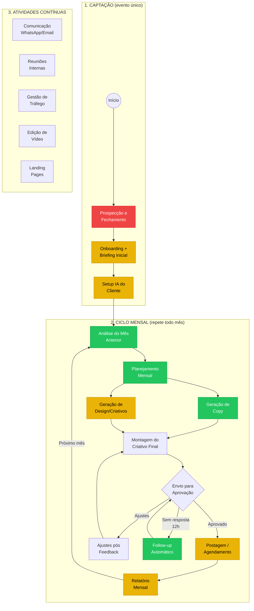
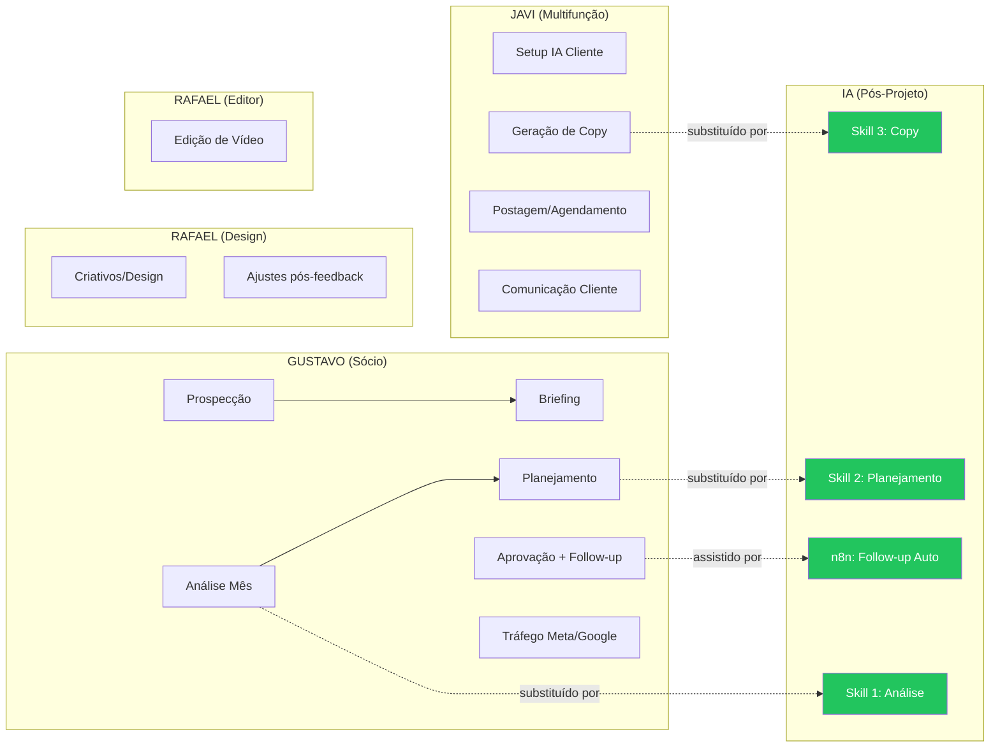

# BPMN Básico — Bravo Agency

> **Projeto:** Bravo Agency — Sistema Completo
> **Objetivo:** Mapear o ciclo mensal por cliente com notação BPMN simplificada
> **Baseado em:** framework-processo.md (15 processos mapeados)
> **Uso:** Apresentar no discovery 26/04 para validar fluxo com Gustavo

---

## 1. Ciclo Mensal por Cliente (BPMN)



### Legenda

| Cor | Significado | Ação no projeto |
|-----|-------------|-----------------|
| **Verde** | Automatizar neste projeto (Skills 1-3) | Semanas 2-3 |
| **Amarelo** | Assistido com IA — fase 2 | Proposta futura |
| **Vermelho** | Manual (requer Gustavo) | Fora do escopo |
| **Branco** | Atividades de suporte contínuas | Paralelas ao ciclo |

---

## 2. Raias por Responsável (Swimlane)



---

## 3. Sequência Detalhada com Tempos (preencher no discovery)

| Passo | Atividade | Responsável | Tempo/cliente | Automação |
|-------|-----------|-------------|---------------|-----------|
| 1 | Análise métricas mês anterior | Gustavo | ~45min | **SKILL 1** |
| 2 | Planejamento calendário posts | Gustavo + IA | ~30min | **SKILL 2** |
| 3 | Geração de copy (8 posts) | Javi + IA | ~20min × 8 | **SKILL 3** |
| 4 | Geração de design/criativos | Rafael | ~30min × 8 | Fase 2 |
| 5 | Montagem criativo final | Rafael + Javi | ~10min × 8 | Fase 2 |
| 6 | Envio para aprovação cliente | Gustavo/Javi | ~10min | **n8n** |
| 7 | Follow-up (cobrar resposta) | Gustavo | ~5min × N | **n8n** |
| 8 | Ajustes pós-feedback | Rafael/Javi | variável | Manual |
| 9 | Postagem/agendamento | Javi | ~10min × 8 | Fase 2 |
| 10 | Relatório mensal | Gustavo | ~30min | Fase 2 |

**Tempo total estimado por cliente/mês:** ~8-10h (validar no discovery)
**Tempo com automação (Skills 1-3):** ~4-6h (-40 a -50%)

---

## 4. Gargalos Visuais

```
FLUXO ATUAL (sem automação):
══════════════════════════════════════════════════════════

Análise ──────── Planejamento ──────── Copy ────────────
 45min/cliente    30min/cliente    20min × 8 = 160min
 GUSTAVO          GUSTAVO           JAVI
 ████████████     ██████████        ████████████████████

                                    Design ─────────────
                                    30min × 8 = 240min
                                    RAFAEL
                                    ██████████████████████████████

Aprovação ──── Follow-up ──── Ajustes ──── Postagem ────
 10min + ESPERA   5min × N      variável    10min × 8
 GUSTAVO/JAVI    GUSTAVO        RAFAEL      JAVI
 ██░░░░░░░░░░    ██░░░██░░░██   ████        ████████████

══════════════════════════════════════════════════════════

GARGALOS:
  1. Gustavo concentra Análise + Planejamento + Aprovação
     → ~75min/cliente + follow-ups = ~25-35h/mês nos 20
  2. Espera do cliente na aprovação (6-12h média)
     → Bloqueia postagem, gera retrabalho
  3. Copy e Design são paralelos mas sem coordenação
     → Copy pronto mas design atrasa (ou vice-versa)
```

---

## 5. Fluxo Pós-Automação (visão futura)

```
FLUXO COM SKILLS (pós-projeto):
══════════════════════════════════════════════════════════

  IA Skill 1        IA Skill 2        IA Skill 3
  ┌─────────┐      ┌───────────┐      ┌──────────┐
  │ Análise │ ───→ │Planejam.  │ ───→ │  Copy    │
  │ ~5min   │      │ ~5min     │      │ ~2min×8  │
  │ Validar │      │ Validar   │      │ Validar  │
  └─────────┘      └───────────┘      └──────────┘
   Gustavo OK       Gustavo OK         Javi OK
   (5min)            (5min)             (16min)

                    ┌──────────────────┐
                    │Design (Rafael)   │  ← Paralelo
                    │~30min × 8 = 240m │
                    └──────────────────┘

  n8n Auto          n8n Auto
  ┌─────────┐      ┌───────────┐
  │ Envio   │ ───→ │Follow-up  │ ───→ Postagem
  │ Aprovação│      │Automático │      (Javi)
  │ WhatsApp│      │ 12h/24h   │
  └─────────┘      └───────────┘

══════════════════════════════════════════════════════════

RESULTADO:
  Gustavo: 75min → 10min por cliente (validar outputs)
  Javi: Copy manual → Revisão de copy gerado
  Aprovação: Manual → Automática com lembretes
  
  Capacidade: 20 → 30+ clientes sem contratar
```

---

*Criado: 24/04/2026*
*Baseado em: framework-processo.md + dados reunião 20/04/2026*
*Notação: BPMN simplificado com Mermaid (renderizável em qualquer viewer markdown)*
