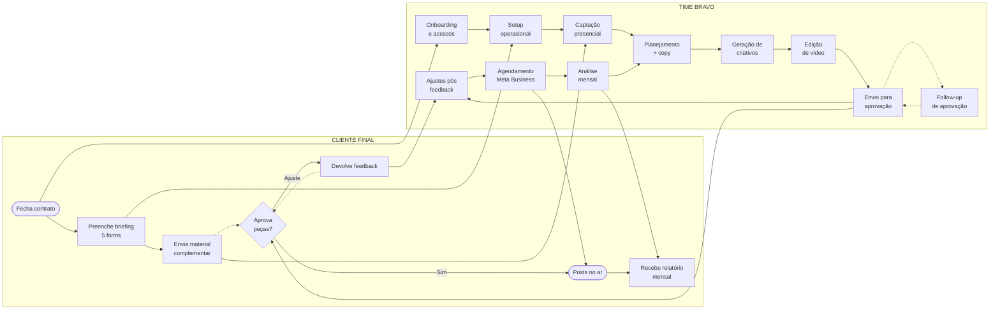
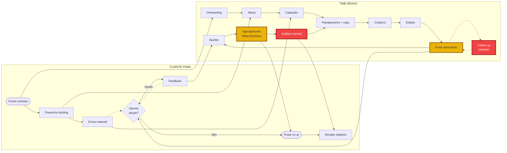
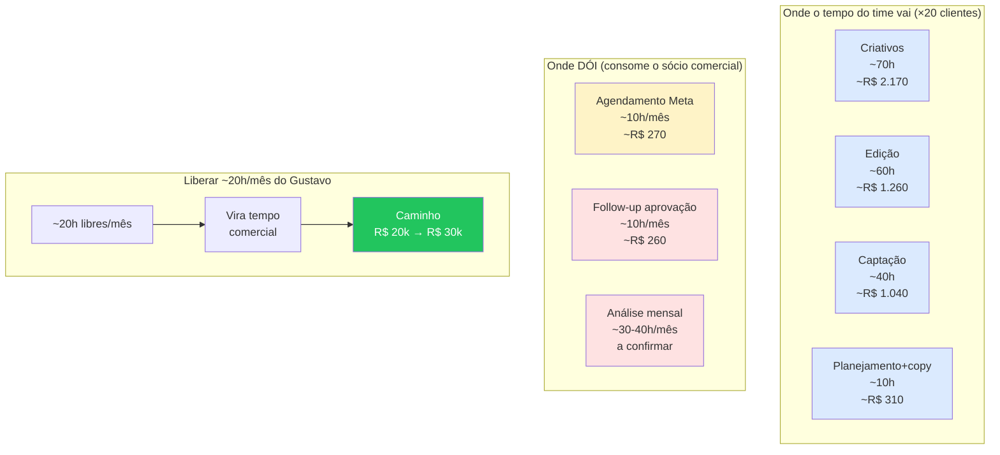
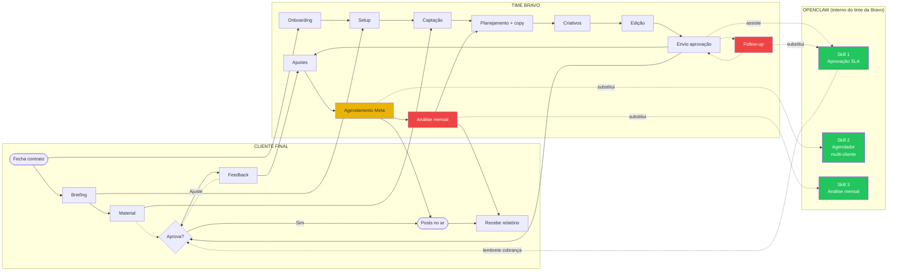
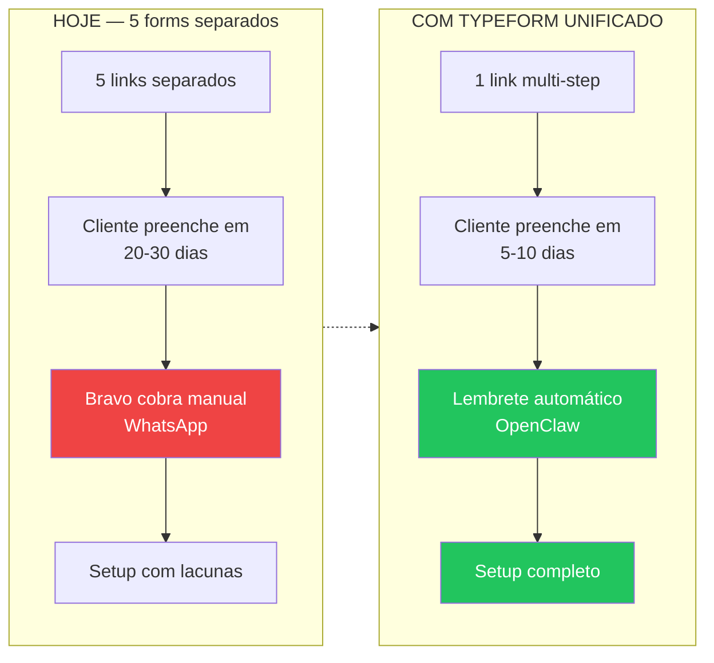

# Fluxos para Miro — Apresentação Bravo

> [!info] Para que serve
> Material pronto pra importar no Miro e apresentar pro time da Bravo. **Sequência de 4 boards** que conta a história: como é hoje → onde dói → o que entra → como fica. Usa Mermaid (Miro suporta importação via plugin "Mermaid to Miro" ou copy/paste em texto sticky).

> [!tip] Como importar no Miro
> 1. Abrir o board Miro do projeto Bravo (criar 1 frame por board abaixo)
> 2. Plugin "Mermaid Diagrams for Miro" → colar o código → "Insert"
> 3. Ou: usar o site `mermaid.live` → exportar PNG/SVG → arrastar pro Miro
> 4. Para os boards de raias, ajustar manualmente o tamanho dos nós após importar (Mermaid no Miro tende a ficar comprimido)

---

## Roteiro de apresentação (sugestão de 30-45 min)

| Tempo | Board | Objetivo |
|-------|-------|----------|
| 5 min | 1. Fluxo atual | "Vocês se reconhecem aqui?" — validar que o desenho bate com a realidade |
| 10 min | 2. Onde dói (gargalos) | Mostrar onde o tempo evapora e quem segura cada gargalo |
| 5 min | 3. Custo do que dói | Tradução em horas e dinheiro do que foi visto no board 2 |
| 10 min | 4. Onde a automação entra | Apresentar OpenClaw como camada interna + as 3 skills |
| 10 min | Discussão | Validar reframe + dúvidas |

---

## Board 1 — Fluxo atual (raias cliente × Bravo)

**Objetivo:** validar com o time se o desenho representa a operação real.

**Perguntas pra fazer no board:**
- "Esse fluxo bate com como vocês trabalham?"
- "Tem alguma etapa que não aparece aqui?"
- "Os pontilhados são onde geralmente vocês esperam — concordam?"

---

## Board 2 — Onde dói (mesmo fluxo, com gargalos pintados)

**Objetivo:** apontar visualmente os 3 gargalos.

**Comentário:**
- 🔴 **Vermelho (Follow-up + Análise mensal):** consomem o sócio comercial 100%
- 🟡 **Amarelo (Envio + Agendamento):** atrito repetitivo, drena o time

**Frase-chave:**
> "Os processos que mais doem não são os mais caros — são os que travam o Gustavo. E é o Gustavo que precisa estar livre pra crescer R$ 20k → R$ 30k."

---

## Board 3 — Custo do que dói (números)

**Objetivo:** traduzir gargalo em horas e dinheiro.

**Frase-chave:**
> "O criativo é mais caro mas já está automatizado (Content Machine). A dor real está em coisas que custam pouco em horas-Bravo, mas custam **o sócio comercial inteiro**."

---

## Board 4 — Onde a automação interna entra

**Objetivo:** apresentar a camada OpenClaw + 3 skills + alinhar fronteira.

**Mensagens-chave (decorar antes da reunião):**

1. **"Onde os agentes ficam":** dentro do OpenClaw da Bravo. Time abre OpenClaw, chama a skill, valida o output, segue. Não é uma plataforma nova pra aprender — é uma camada dentro do que vocês já têm.

2. **"Onde os agentes NÃO ficam":** não conversam com cliente final, não fazem login no Meta sozinhos, não respondem WhatsApp. **Única exceção:** lembrete de cobrança automatizado pra cliente que não respondeu (mensagem programada disparada pelo OpenClaw).

3. **"Por que não n8n agora":** o projeto atual entrega skills internas no OpenClaw. Integrações externas (n8n, conectores) são fase 2 — escopo e custo diferentes. Foco agora: deixar o time da Bravo com superpoderes internos.

4. **"O que vocês ganham":**
   - Skill 1: Gustavo para de carteirar manualmente (libera ~10h/mês dele)
   - Skill 2: agendamento multi-cliente sem trocar conta 20× no Meta (libera ~8-10h/mês do time)
   - Skill 3: análise mensal padronizada e rápida (libera ~20-30h/mês do Gustavo)

---

## Board 5 (opcional) — Bônus de processo: onboarding

**Objetivo:** mostrar o ganho do Typeform unificado, fora do escopo principal mas como follow-up natural.

**Frase-chave:**
> "Esse é bônus de processo — não está no preço, mas faz parte do roteiro. Resolve o gargalo de onboarding que hoje custa ~1h/cliente do Gustavo cobrando manualmente."

---

## Checklist da apresentação

- [ ] Importar os 4 boards no Miro (Board 5 opcional)
- [ ] Ajustar nós manualmente após import (espaçamento)
- [ ] Adicionar foto/avatar dos responsáveis na raia "Time Bravo"
- [ ] Stickies pra anotações ao vivo durante reunião
- [ ] Imprimir/exportar versão estática como backup (caso plugin falhe)
- [ ] Reservar 10 min finais pra discussão e dúvidas

---

## Pendências antes da apresentação

- [ ] Cronometrar análise mensal real (impacta board 3 — números atualizados)
- [ ] Confirmar com Gustavo se a faixa de horas liberadas (~20h/mês) bate com a percepção dele
- [ ] Decidir formato: reunião presencial ou Meet? (Miro funciona bem nos dois)

---

*Criado: 2026-04-27 — material de apresentação visual baseado no [[bpmn-basico]] e [[processo-detalhado]]*
