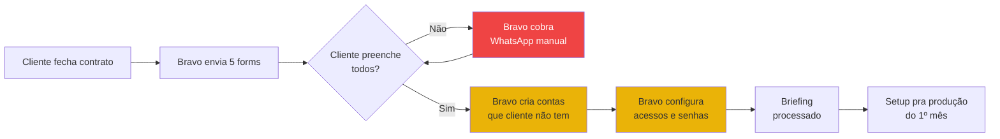
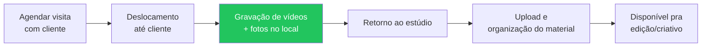
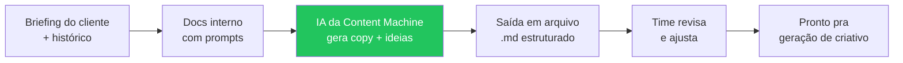
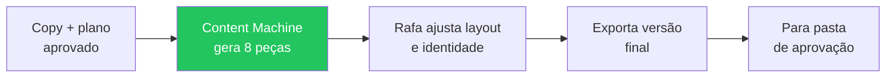
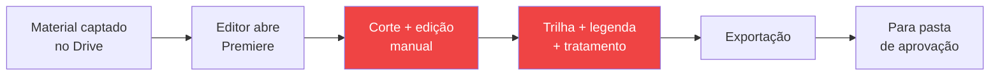
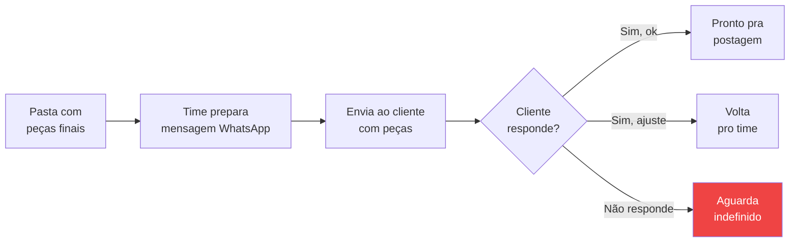
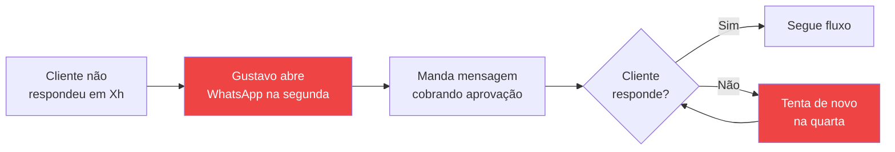
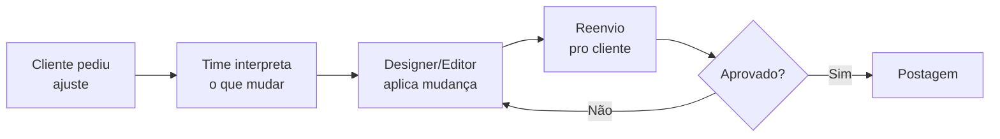
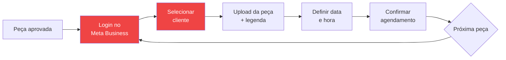
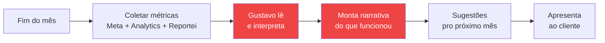

# Processo Detalhado — Bravo Agency

> [!info] Para que serve este documento
> Detalhamento processo a processo do que a Bravo entrega hoje. Cada processo tem: fluxo visual, passo-a-passo, tempo médio por cliente, capacidade mensal e custo agregado. **Material de apresentação pra Bravo se enxergar no espelho** — sem soluções. As propostas de automação ficam em `[[proposta-pos-discovery]]` e o fluxo end-to-end em `[[bpmn-basico]]`.

> [!warning] Custo-hora — leitura agregada
> Os valores de custo neste documento usam o **custo-hora médio ponderado do time produtor: ~R$ 26/h**. Esse valor já inclui o rateio proporcional de ferramentas e infra. **Não representa salário individual de ninguém** — é a hora-máquina da operação. Faixa interna do time: R$ 21–31/h dependendo de quem executa.

---

## Resumo executivo

| # | Processo | Frequência | Tempo/cliente/mês | ×20 clientes | Custo agregado/mês |
|---|----------|------------|-------------------|--------------|--------------------|
| 1 | Onboarding (cliente novo) | evento único | ~3 sem ciclo (latência) | ~5h amortiz. | ~R$ 130 |
| 2 | Briefing inicial (5 forms) | evento único | ~2-4h cliente solo | — | — (custo cliente) |
| 3 | Captação presencial | mensal | ~2h | ~40h | ~R$ 1.040 |
| 4 | Planejamento + copy | mensal | ~30 min | ~10h | ~R$ 310 |
| 5 | Geração de criativos estáticos | mensal | ~3,5h (8 peças) | ~70h | ~R$ 2.170 |
| 6 | Edição de vídeo | mensal | ~3h (2 vídeos) | ~60h | ~R$ 1.260 |
| 7 | Envio para aprovação | mensal | ~10 min | ~3,3h | ~R$ 100 |
| 8 | Follow-up de aprovação | mensal | ~30 min | ~10h | ~R$ 260 |
| 9 | Ajustes pós-feedback | mensal | ~30 min | ~10h | ~R$ 260 |
| 10 | Agendamento Meta Business | mensal | ~25 min | ~8-10h | ~R$ 270 |
| 11 | Análise mensal + relatório | mensal | n/d (a cronometrar) | n/d | n/d |
| | **Total parcial mapeado** | | | **~216h** | **~R$ 5.800** |

> [!tip] Como ler
> Os 3 processos mais caros (criativos, edição, captação) **não são candidatos naturais a automação** — são físicos ou já automatizados (Content Machine). Os candidatos reais (aprovação + agendamento) custam pouco em horas-Bravo, **mas consomem o sócio comercial** — que é o gargalo pra escalar receita.

---

## 1. Onboarding de cliente novo

### Fluxo atual

### Passos

| Passo | Atividade | Quem | Tempo |
|-------|-----------|------|-------|
| 1 | Disparo dos 5 forms (Tráfego, Conteúdos, Site, Acessos, Contrato) | Bravo | ~10 min |
| 2 | Cliente preenche solo (sem follow-up automático) | Cliente | 2-4h em 20-30 dias |
| 3 | Bravo cobra atrasos por WhatsApp | Bravo (Gustavo) | ~1h por cliente |
| 4 | Cliente envia logo/material pelo WhatsApp (fora do form) | Cliente + Bravo | ~30 min |
| 5 | Bravo cria contas que cliente não tem (GMB, Analytics, etc.) | Bravo (Ravi) | 30-60 min |
| 6 | Bravo organiza acessos + briefing em sistema interno | Bravo | ~30 min |

### Métricas

| Métrica | Valor |
|---------|-------|
| Tempo Bravo por cliente | ~3h amortizado |
| Tempo cliente | 2-4h líquidas, 20-30 dias corridos |
| Custo agregado | ~R$ 130/mês (amortizado) |
| Latência média | 20-30 dias do contrato à 1ª produção |

### Gargalo
- 70% do mês "evapora" em cliente procrastinando entre forms — sem follow-up automático
- Bravo só descobre tarde que cliente não tem contas básicas (GMB, Analytics)

---

## 2. Captação presencial

### Fluxo atual

### Passos

| Passo | Atividade | Quem | Tempo |
|-------|-----------|------|-------|
| 1 | Agendamento + confirmação | Bravo (Gustavo + Ravi) | ~15 min |
| 2 | Deslocamento ida/volta | Time de captação | variável (cidade) |
| 3 | Gravação no local (vídeo + foto) | Gustavo + Ravi | ~1,5h |
| 4 | Upload + nomenclatura no Drive | Ravi | ~15 min |

### Métricas

| Métrica | Valor |
|---------|-------|
| Tempo Bravo por cliente/mês | ~2h |
| Frequência | mensal (varia por cliente) |
| ×20 clientes | ~40h/mês |
| Custo agregado | ~R$ 1.040/mês |

### Característica
- **Físico, não automatizável** — entra no documento como custo conhecido, não como alvo de skill
- Concentra o sócio comercial (Gustavo) em um dia inteiro fora do escritório

---

## 3. Planejamento + Copy (mensal)

### Fluxo atual

### Passos

| Passo | Atividade | Quem | Tempo |
|-------|-----------|------|-------|
| 1 | Abrir doc interno do cliente | Rafa | ~5 min |
| 2 | Rodar prompt na IA (Content Machine) | Rafa | ~10 min |
| 3 | Revisar e ajustar copy | Rafa | ~15 min |

### Métricas

| Métrica | Valor |
|---------|-------|
| Tempo por cliente/mês | ~30 min |
| ×20 clientes | ~10h/mês |
| Custo agregado | ~R$ 310/mês |
| Status | **Já automatizado** (Content Machine — plugin Figma) |

### Característica
- Já está rodando — Bravo só revisa
- Skill 3 (Análise mensal) **consome esse output** como contexto de IA — não substitui

---

## 4. Geração de criativos estáticos

### Fluxo atual

### Passos

| Passo | Atividade | Quem | Tempo |
|-------|-----------|------|-------|
| 1 | Geração automática (Content Machine) | Rafa (operando) | ~1h |
| 2 | Ajuste fino + identidade visual | Rafa | ~2h |
| 3 | Exportação e organização | Rafa | ~30 min |

### Métricas

| Métrica | Valor |
|---------|-------|
| Tempo por cliente/mês | ~3,5h (8 peças) |
| ×20 clientes | ~70h/mês |
| Custo agregado | ~R$ 2.170/mês |
| Status | **Já automatizado** (Content Machine) |

### Característica
- **Maior custo do operacional** — mas já automatizado
- Não é dor da Bravo, é o motor que funciona

---

## 5. Edição de vídeo

### Fluxo atual

### Passos

| Passo | Atividade | Quem | Tempo |
|-------|-----------|------|-------|
| 1 | Triagem do material captado | Editor | ~20 min |
| 2 | Corte e edição (1-2 vídeos/dia produção) | Editor | ~2h |
| 3 | Trilha, legenda, tratamento | Editor | ~30 min |
| 4 | Exportação + entrega | Editor | ~10 min |

### Métricas

| Métrica | Valor |
|---------|-------|
| Tempo por cliente/mês | ~3h (2 vídeos) |
| ×20 clientes | ~60h/mês |
| Custo agregado | ~R$ 1.260/mês |
| Output | abaixo da meta (capacidade subutilizada) |

### Gargalo
- **Não é problema técnico** — é capacidade humana e ritmo
- POC Premiere + IA é fase 2 (não escopo do projeto atual)

---

## 6. Envio para aprovação

### Fluxo atual

### Passos

| Passo | Atividade | Quem | Tempo |
|-------|-----------|------|-------|
| 1 | Preparar mensagem + anexos | Rafa / Gustavo | ~10 min |
| 2 | Enviar pelo WhatsApp do cliente | Rafa / Gustavo | ~2 min |

### Métricas

| Métrica | Valor |
|---------|-------|
| Tempo por cliente/mês | ~10 min |
| ×20 clientes | ~3,3h/mês |
| Custo agregado | ~R$ 100/mês |
| Latência média espera resposta | 6-12h (varia muito) |

### Gargalo
- Sem timer, sem visibilidade de status, sem cláusula de SLA
- Travamento aqui bloqueia a postagem (próximo processo)

---

## 7. Follow-up de aprovação ("carteirar")

### Fluxo atual

### Passos

| Passo | Atividade | Quem | Tempo |
|-------|-----------|------|-------|
| 1 | Identificar quem não respondeu | Gustavo | ~5 min × 2 dias |
| 2 | Mandar mensagem cobrando | Gustavo | ~10 min × N |
| 3 | Repetir mid-week | Gustavo | ~10 min × N |

### Métricas

| Métrica | Valor |
|---------|-------|
| Tempo por cliente/mês | ~30 min |
| ×20 clientes | ~10h/mês |
| Custo agregado | ~R$ 260/mês |
| Custo de oportunidade | **alto** — consome único comercial |

### Gargalo
- 100% do follow-up depende do Gustavo
- Cada hora "carteirando" = hora não vendendo
- Sem cláusula contratual que defina prazo de aprovação do cliente

---

## 8. Ajustes pós-feedback

### Fluxo atual

### Passos

| Passo | Atividade | Quem | Tempo |
|-------|-----------|------|-------|
| 1 | Ler feedback (geralmente WhatsApp) | Rafa / Editor | ~5 min |
| 2 | Ajustar peça | Rafa / Editor | ~20 min |
| 3 | Reenviar | Rafa | ~5 min |

### Métricas

| Métrica | Valor |
|---------|-------|
| Tempo por cliente/mês | ~30 min |
| ×20 clientes | ~10h/mês |
| Custo agregado | ~R$ 260/mês |
| Variabilidade | alta — depende do cliente |

### Gargalo
- Feedback chega solto no WhatsApp, sem contexto da peça
- Time recebe "essa cor tá feia" sem print/referência

---

## 9. Agendamento no Meta Business

### Fluxo atual

### Passos

| Passo | Atividade | Quem | Tempo |
|-------|-----------|------|-------|
| 1 | Login Meta Business + trocar conta | Ravi / Rafa | ~3 min × N |
| 2 | Subir peça | Ravi / Rafa | ~5 min × peça |
| 3 | Escrever legenda + hashtags | Ravi / Rafa | ~10 min × peça |
| 4 | Configurar agendamento | Ravi / Rafa | ~3 min × peça |
| 5 | Repetir pra Instagram + Facebook | Ravi / Rafa | duplica tempo |

### Métricas

| Métrica | Valor |
|---------|-------|
| Tempo por cliente/mês | ~25 min (8 posts × 2 redes) |
| ×20 clientes | ~8-10h/mês |
| Custo agregado | ~R$ 270/mês |
| Característica | **repetitivo + login-troca-login** |

### Gargalo
- Trocar conta no Meta Business 20× por mês é o pesadelo da operação
- Esquecimento de agendar = post fora do calendário

---

## 10. Análise mensal + relatório

### Fluxo atual (a cronometrar)

### Passos

| Passo | Atividade | Quem | Tempo (estimativa) |
|-------|-----------|------|---------------------|
| 1 | Puxar dados das plataformas | Gustavo | ~20 min |
| 2 | Cruzar com objetivo do mês | Gustavo | ~30 min |
| 3 | Escrever narrativa do relatório | Gustavo | ~30 min |
| 4 | Definir sugestões pro próximo mês | Gustavo | ~30 min |

### Métricas

| Métrica | Valor |
|---------|-------|
| Tempo por cliente/mês | **a cronometrar** (~1,5-2h estimado) |
| ×20 clientes | ~30-40h/mês |
| Custo agregado | a confirmar |
| Característica | concentra Gustavo, não tem padrão repetível |

### Gargalo
- **Não foi cronometrado no discovery** — pendência aberta
- Concentra o sócio comercial novamente
- Sem template que padronize narrativa entre clientes

---

## Mapa de calor — onde dói

| Processo | Custo direto | Consome o sócio comercial? | Já automatizado? | Candidato a skill? |
|----------|--------------|----------------------------|-------------------|---------------------|
| Onboarding | baixo | parcial | não | bônus de processo |
| Captação | alto | sim | não automatizável | não |
| Planejamento + copy | baixo | não | sim (Content Machine) | não |
| Criativos estáticos | **muito alto** | não | sim (Content Machine) | não |
| Edição de vídeo | alto | não | parcial (POC fase 2) | não |
| Envio aprovação | baixo | parcial | não | **sim** (parte da Skill 1) |
| Follow-up aprovação | médio | **sim, 100%** | não | **sim — Skill 1** |
| Ajustes feedback | médio | parcial | não | parcial |
| Agendamento Meta | médio | parcial | não | **sim — Skill 2** |
| Análise mensal | a confirmar | **sim, 100%** | não | **sim — Skill 3** |

> [!tip] Leitura
> **Custo direto não é o critério.** O critério é "consome o Gustavo" — porque Gustavo é o único comercial e o teto de receita está nele. Os 3 candidatos a skill são os que liberam horas dele.

---

## Próximos passos

1. **Cronometrar análise mensal real** com Gustavo (1 cliente, na próxima virada de mês)
2. **Apresentar este documento** numa reunião de validação com o time da Bravo (ver `[[fluxos-miro]]` pro material visual)
3. **Validar reframe das 3 skills** (`[[proposta-pos-discovery]]`)

---

*Criado: 2026-04-27 — detalhamento dos processos da Bravo com base no [[levantamento-discovery]] e custos do [[analise-custo-processo]]*
