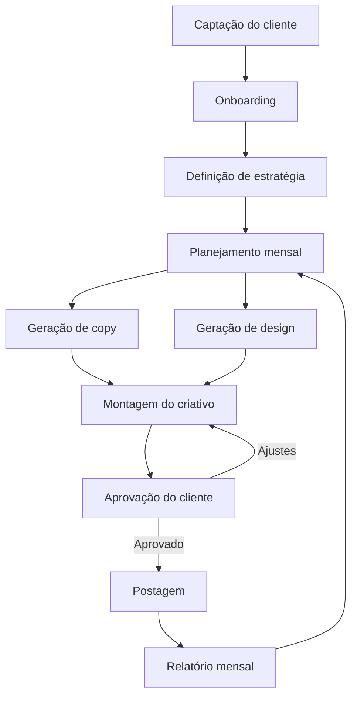

# Framework de Mapeamento e Priorização de Processos

> **Projeto:** Bravo Agency
> **Método:** Process Assessment Matrix + Automation Score
> **Baseado em:** Value Stream Mapping (Lean) + RPA Opportunity Assessment

---

## 1. Mapeamento de Atividades

Para cada etapa do processo, capturar:

### Template por Atividade

```
ATIVIDADE: [nome]
MÓDULO: [captação | onboarding | estratégia | planejamento | copy | design | aprovação | postagem | relatório]

Quem faz:        [ ] Gustavo  [ ] Rafael  [ ] Javi  [ ] Cliente  [ ] Ferramenta
Frequência:      [ ] 1x/cliente  [ ] Mensal  [ ] Semanal  [ ] Diário  [ ] Por demanda
Tempo médio:     ___ min/vez
Volume mensal:   ___ vezes/mês (x20 clientes = ___ total)
Tempo total/mês: ___ horas

Ferramenta atual:  [ ] Manual  [ ] ChatGPT  [ ] Canva  [ ] ClickUp  [ ] WhatsApp  [ ] Outro: ___
Tipo:              [ ] Criativo  [ ] Analítico  [ ] Comunicação  [ ] Operacional

Input:   ___
Output:  ___
Depende de: [atividade anterior]
Bloqueia: [atividade seguinte]

Dor principal: ___
```

---

## 2. Dimensões de Avaliação (Score 1-5)

Cada atividade recebe nota em 6 dimensões:

| Dimensão | 1 (baixo) | 3 (médio) | 5 (alto) |
|----------|-----------|-----------|----------|
| **Tempo** — quanto tempo consome | <15min/vez | 30-60min/vez | >2h/vez |
| **Volume** — com que frequência acontece | 1x/mês | Semanal | Diário ou por cliente |
| **Repetitividade** — é sempre igual? | Cada vez é diferente | Padrão com variações | Sempre o mesmo passo-a-passo |
| **Impacto** — se automatizar, quanto ganha? | Pouco ganho | Ganho moderado | Libera horas significativas |
| **Viabilidade** — IA consegue fazer? | Precisa julgamento humano forte | IA faz 70%, humano ajusta | IA faz 90%+, humano só valida |
| **Custo Atual** — quanto custa hoje? | Quase nada | Ferramenta paga ou tempo moderado | Alto custo de tempo/pessoa/ferramenta |

### Score de Prioridade

```
Score = (Tempo + Volume + Repetitividade + Impacto + Viabilidade + Custo Atual) / 6
```

| Score | Prioridade | Ação |
|-------|-----------|------|
| 4.0 — 5.0 | AUTOMATIZAR PRIMEIRO | Skill prioritária |
| 3.0 — 3.9 | AUTOMATIZAR DEPOIS | Próxima fase |
| 2.0 — 2.9 | ASSISTIR COM IA | IA ajuda, humano lidera |
| 1.0 — 1.9 | MANTER MANUAL | Não compensa automatizar |

---

## 3. Matriz de Processos da Bravo

### Preenchimento no Discovery

| # | Atividade | Módulo | Quem | Tempo/vez | Vol/mês | Ferramenta | T | V | R | I | Vi | C | Score | Prioridade |
|---|-----------|--------|------|-----------|---------|------------|---|---|---|---|----|----|-------|-----------|
| 1 | | captação | | | | | | | | | | | | |
| 2 | | onboarding | | | | | | | | | | | | |
| 3 | | onboarding | | | | | | | | | | | | |
| 4 | | estratégia | | | | | | | | | | | | |
| 5 | | planejamento | | | | | | | | | | | | |
| 6 | | copy | | | | | | | | | | | | |
| 7 | | design | | | | | | | | | | | | |
| 8 | | aprovação | | | | | | | | | | | | |
| 9 | | postagem | | | | | | | | | | | | |
| 10 | | relatório | | | | | | | | | | | | |

*(preencher no discovery — linhas serão adicionadas conforme mapeamento)*

---

## 4. Análise de Custo por Processo

### Custo-hora estimado da Bravo

| Pessoa | Custo estimado/hora | Baseado em |
|--------|-------------------|------------|
| Gustavo (sócio) | R$80-120/h | Gestão, comercial |
| Rafael (design) | R$40-60/h | Operação criativa |
| Javi (multifunção) | R$40-60/h | Operação geral |
| Rafael Editor (vídeo) | R$40-60/h | Edição |

### Custo mensal por atividade

```
Custo/atividade = (tempo/vez × volume/mês) × custo-hora da pessoa
```

| Atividade | Tempo/vez | Vol/mês | Quem | Custo-hora | Custo/mês |
|-----------|-----------|---------|------|-----------|-----------|
| [preencher] | | | | | |

**Total custo operacional atual/mês:** R$___

### Custo com automação

| Atividade | Custo IA/vez | Vol/mês | Custo IA/mês | Economia vs. manual |
|-----------|-------------|---------|-------------|-------------------|
| [preencher] | | | | |

**Total custo com IA/mês:** R$___
**Economia mensal:** R$___

---

## 5. Mapa de Dependências

### Fluxo linear (preencher no discovery)



### Legenda de automação (preencher após scoring)

```
🟢 Automatizado (IA faz, humano valida)
🟡 Assistido (IA ajuda, humano lidera)  
🔴 Manual (humano faz tudo)
⚪ Fora do escopo atual
```

---

## 6. Decisão: Quais 3 Skills?

Após o scoring, as 3 atividades com maior score viram as 3 skills do projeto.

### Critérios de desempate

1. **Sequência lógica** — preferir skills que se conectam (ex: análise → planejamento faz mais sentido que análise → postagem)
2. **Quick win** — se duas têm score igual, priorizar a mais rápida de implementar
3. **Dor do Gustavo** — o que ele mais reclama pesa no desempate

### Resultado (preencher pós-discovery)

| Posição | Atividade | Score | Justificativa |
|---------|-----------|-------|--------------|
| Skill 1 | | | |
| Skill 2 | | | |
| Skill 3 | | | |
| Backlog | | | Próxima fase |
| Backlog | | | Próxima fase |

---

## 7. Roteiro de Perguntas por Módulo

### Captação
- Como o cliente te encontra? (indicação, tráfego, cold?)
- Quem faz o primeiro contato?
- Quanto tempo entre primeiro contato e fechamento?
- Tem proposta padrão ou faz sob medida?

### Onboarding
- O que pede pro cliente no dia 1? (acessos, briefing, materiais)
- Tem formulário ou é por conversa?
- Quanto tempo leva o onboarding completo?
- O que mais atrasa nessa fase?

### Estratégia
- Quem define a estratégia de conteúdo?
- Com base em quê? (dados, intuição, nicho)
- Muda todo mês ou é fixa?
- O cliente participa dessa definição?

### Planejamento
- Todo mês vocês montam um plano? Como?
- Quantos posts/mês por cliente?
- Quanto tempo leva montar 1 plano?
- ×20 clientes = quanto tempo total?

### Copy
- Quem escreve? (Javi, ChatGPT, Claude?)
- Quanto tempo por texto?
- Tem padrão de tom/estilo por cliente?
- ×20 clientes = quanto tempo total?

### Design
- Rafael, me mostra como tu faz um post do zero
- Quanto tempo por peça?
- Usa template ou faz do zero?
- Canva? Figma? Photoshop?
- ×20 clientes = quanto tempo total?

### Aprovação
- Como manda pro cliente aprovar? (WhatsApp, email, link?)
- Quanto tempo o cliente demora pra responder?
- O que mais atrasa aqui?
- Quantas rodadas de ajuste em média?

### Postagem
- Quem posta? Manual ou agendado?
- Usa qual ferramenta? (Meta Business, mLabs, manual?)
- Quanto tempo por cliente?

### Relatório
- Mandam relatório pro cliente? Com que frequência?
- Quanto tempo pra montar 1 relatório?
- O cliente realmente lê?

---

## 8. Cheat Sheet — Para Levar no Discovery

### Perguntas universais para cada atividade:
1. **Quem** faz isso hoje?
2. **Quanto tempo** leva?
3. **Com que frequência?**
4. **Usa alguma ferramenta?**
5. **O que mais te irrita nessa etapa?**
6. **Se pudesse apertar um botão e pular essa etapa, pularia?**

### Red flags de automação:
- "A gente copia e cola..." → AUTOMATIZAR
- "Toda vez é a mesma coisa..." → AUTOMATIZAR
- "Demora porque o cliente..." → ASSISTIR (n8n + lembretes)
- "Depende do feeling..." → MANTER MANUAL (por enquanto)
- "Cada cliente é diferente..." → PARAMETRIZAR (template + variáveis)

---

*Framework criado: 24/04/2026*
*Referências: Value Stream Mapping, RPA Opportunity Assessment, Lean Six Sigma*
