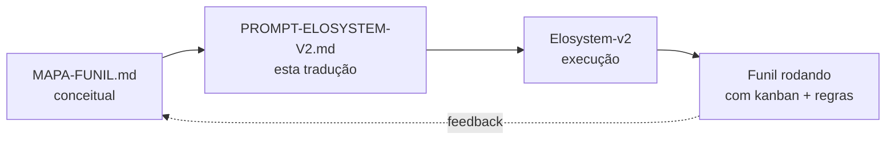

# Prompt para Elosystem-v2 — Criar Funil Comercial Eloscope

> **Como usar:** abra o chat do Elosystem-v2, cole o bloco `PROMPT FINAL` abaixo na íntegra. O sistema vai (1) auditar a estrutura atual de funis/pipelines/etapas, (2) comparar com a especificação Eloscope, (3) apresentar um diff, (4) só depois criar/atualizar com confirmação.
>
> **Importante:** o prompt está construído pra **não destruir nada existente**. Ele valida antes de criar.

---

## Contexto deste prompt

A Eloscope acabou de consolidar (no segundo cérebro) o **mapa do funil comercial do Elo Sales OS** com 4 pipelines paralelos e 7 etapas. O Elosystem-v2 ainda **não tem** esse funil estruturado nativamente (ou tem versão antiga). Este prompt traz a especificação completa pra ele criar/atualizar.

**Fontes canônicas no cérebro:**
- `areas/vendas/funil/MAPA-FUNIL.md` — cockpit com flowchart Mermaid + regras automáticas
- `areas/vendas/funil/etapas/04-reuniao.md` — modelo de etapa preenchido (Enertelles flow)
- `empresa/projetos/sales-os/02-comercial/pipeline.md` — 46 leads classificados
- `empresa/projetos/operacao-eloscope/01-marketing/playbook-aquisicao.md` — autoria Victor

---

## PROMPT FINAL — copiar a partir daqui ↓

````text
# TAREFA: Auditar e criar funil comercial Eloscope (Elo Sales OS)

Você é o Elosystem-v2 operando no modo arquiteto de funil. Sua tarefa é dupla:

## FASE 1 — AUDITORIA (faça primeiro, ANTES de criar qualquer coisa)

Antes de criar/modificar nada, responda em ordem:

1. **Existe alguma entidade "funil", "pipeline", "deal stage" ou "negócio" no banco hoje?**
   - Liste tabelas/coleções relacionadas.
   - Liste pipelines existentes (nome + nº de etapas + nº de deals dentro).
   - Liste etapas de cada pipeline (nome + ordem + cor/categoria se houver).

2. **Existe alguma automação/trigger ligada a mudança de etapa?**
   - Liste workflows n8n, edge functions, triggers SQL, ou regras de CRM ativas.

3. **Existem leads/negócios já cadastrados?**
   - Quantos no total?
   - Distribuídos em quais pipelines/etapas?

4. **Qual o esquema atual de um "deal/negócio"?**
   - Campos obrigatórios.
   - Relacionamentos (lead, dono, valor, datas).

Apresente esse levantamento como TABELA antes de ir pra Fase 2. Se algo já existir com nome parecido (ex: "Funil principal" com 5 etapas), NÃO sobrescreva — proponha estratégia (migrar / coexistir / arquivar). Aguarde confirmação humana antes de seguir.

## FASE 2 — ESPECIFICAÇÃO DO FUNIL ELOSCOPE (criar/atualizar conforme Fase 1)

### 2.1 Estrutura: 4 pipelines paralelos + reativação

Crie (ou atualize) 4 pipelines independentes. Cada um tem origem distinta mas converge nas etapas de qualificação em diante:

| # | Pipeline | Cor | Dono padrão | SLA crítico |
|---|----------|-----|-------------|-------------|
| 1 | **Inbound** | 🔵 azul (#1976d2) | Lucas | resposta < 30min |
| 2 | **Outbound** | 🟠 laranja (#f57c00) | Lucas | abordagem < 24h |
| 3 | **Indicação** | 🟣 roxo (#7b1fa2) | Lucas | abordagem < 24h, cita indicador |
| 4 | **Clientes Ativos / Recorrência** | 🟢 verde (#388e3c) | Victor | onboarding < 7d |

### 2.2 Etapas — pipelines 1, 2, 3 (aquisição)

Os 3 pipelines de aquisição (Inbound/Outbound/Indicação) compartilham as **mesmas 7 etapas**:

| Ordem | Etapa | Slug | SLA padrão | Score automático | Próxima ação default |
|-------|-------|------|------------|------------------|----------------------|
| 1 | Prospect / Recebimento | `01-prospect` | < 30min (inbound) / < 24h (outras) | inicial: 50 | Primeiro contato pessoal |
| 2 | Contato Inicial | `02-contato-inicial` | resposta < 2h após primeiro contato | +10 se respondeu | Agendar reunião |
| 3 | Qualificação BANT | `03-qualificacao` | < 48h | +20 se 3+ critérios BANT GO | Marcar reunião 45min |
| 4 | Reunião de Diagnóstico | `04-reuniao` | call de 45min agendada | +30 se compareceu | Enviar proposta < 24h |
| 5 | Proposta Enviada | `05-proposta` | proposta no Drive < 24h após reunião | +20 | Follow-up D+1 |
| 6 | Follow-up / Negociação | `06-follow-up-negociacao` | cadência D+1/D+3/D+7/D+14/D+30 | -5 a cada 7d sem resposta | Resposta ou descarte |
| 7 | Fechamento + Handover | `07-fechamento-handover` | contrato + setup pago | +50 | Migrar pra Pipeline 4 |

Estados terminais (não são etapa, são status):
- ✅ **GANHO** — contrato + setup pago → migra automaticamente pro Pipeline 4
- ❌ **PERDIDO** — sem fechamento → entra fila de reativação (D+30, D+60, D+90)
- 🗄️ **ARQUIVADO** — reativação falhou 3x ou descarte permanente

### 2.3 Etapas — pipeline 4 (Clientes Ativos / Recorrência)

| Ordem | Etapa | Slug | Dono | Critério de saída |
|-------|-------|------|------|-------------------|
| 1 | Onboarding | `ca-01-onboarding` | Victor | Setup técnico completo, primeiro uso real |
| 2 | Aha Moment | `ca-02-aha` | Victor | Cliente viu valor (1ª conversão/automação ativa) |
| 3 | Adoção | `ca-03-adocao` | Victor | Uso recorrente semanal, 80% das features ativas |
| 4 | Expansão / Upsell | `ca-04-expansao` | Lucas + Victor | Upsell vendido OU indicação gerada |

### 2.4 Regras automáticas (workflows)

Crie 4 regras automáticas (R1 já existe no banco — confirmar; R2/R3/R4 implementar):

| ID | Nome | Trigger | Ação | Status atual |
|----|------|---------|------|--------------|
| R1 | Score de inatividade | Lead sem interação ≥ 7 dias | Score -5 (gradual até "frio" abaixo de 30) | ✅ existe — validar |
| R2 | Follow-up automático | Lead muda para etapa `06-follow-up-negociacao` | Cria atividade "Follow-up D+1" automaticamente | 🔄 criar |
| R3 | Notificação handover | Lead muda status para `GANHO` | Notifica Victor no WhatsApp + abre task Onboarding | 🔄 criar |
| R4 | Reativação programada | Lead em `PERDIDO` há 30/60/90 dias | Move pra fila "verificar se esquentou" + cria task | 🔄 criar |

### 2.5 Campos custom obrigatórios no deal

Garanta que o schema do "deal/negócio" tenha estes campos (criar se não existirem):

```
- quadrante: enum [Q1, Q2, Q3, Q4, indefinido]  # foco Q2 = serviço com time comercial
- caminho_comercial: enum [diagnostico_1200, beta_2_3k, real_4_6k, white_label, fora_escopo]
- canal_origem: enum [inbound_lp, inbound_ig, outbound_cold, outbound_evento, indicacao]
- indicador_nome: string nullable  # quem indicou, se canal = indicacao
- score: integer (0-100)
- ultima_interacao: timestamp
- dias_em_etapa: integer  # auto-calc desde mudança de etapa
- icp_match: boolean  # cumpre mínimos (fat ≥80k/mês + vendedor + abertura IA)
- vertical: string  # imobiliária / energia solar / clínica multi / consultoria / agência
```

### 2.6 Visualização Kanban

Cada pipeline deve renderizar como kanban com:
- Colunas = etapas (na ordem definida)
- Cards = deals com: nome do lead, vertical, valor estimado (caminho_comercial), score, dias_em_etapa, dono
- Cor da borda do card = pipeline de origem (azul/laranja/roxo/verde)
- Filtro rápido: Q2 only · ICP match only · score > X · dias_em_etapa > X

### 2.7 Métricas a expor no dashboard

Por pipeline e agregado:
- Taxa de conversão por etapa (entradas → saídas pra próxima)
- Taxa de conversão por canal (indicação ≠ inbound ≠ outbound — separar SEMPRE)
- Tempo médio em cada etapa
- Velocity (deals fechados / mês) por canal
- CAC efetivo (gasto canal / deals fechados)
- LTV/CAC quando Pipeline 4 estiver populado

### 2.8 Benchmarks por canal (pra alimentar metas)

Pré-popular benchmarks de referência (pra comparação, não como meta rígida):

| Canal | Comparecimento reunião | Conversão final (proposta → fechado) |
|-------|------------------------|---------------------------------------|
| Indicação | > 85% | 25-30% |
| Inbound (LP/IG) | > 70% | 15-20% |
| Outbound (cold) | > 50% | 5-10% |

## FASE 3 — APRESENTAR DIFF E AGUARDAR CONFIRMAÇÃO

Antes de executar qualquer CREATE/UPDATE/MIGRATE, apresente em formato de tabela:

```
| Ação | Entidade | Atual | Proposto | Impacto |
|------|----------|-------|----------|---------|
| CREATE | Pipeline "Inbound" | não existe | criar com 7 etapas | nenhum |
| UPDATE | Pipeline "Vendas" | 5 etapas | renomear pra "Outbound" + ajustar etapas | requer migração de N deals |
| ...
```

E pergunte: "Confirma execução? (sim / ajustar / cancelar)".

Só execute após "sim" explícito.

## FASE 4 — APÓS EXECUÇÃO

1. Confirme cada entidade criada com seu ID.
2. Liste deals migrados (se aplicável) com etapa antiga → etapa nova.
3. Gere um link/URL pra cada pipeline visualizar no kanban.
4. Avise se alguma regra automática ficou pendente de credencial (ex: R3 precisa de token WhatsApp).

## RESTRIÇÕES IMPORTANTES

- **NÃO deletar nada** — só renomear/arquivar quando estritamente necessário.
- **NÃO inventar campos** fora do schema acima.
- **NÃO criar pipelines extras** além dos 4 especificados.
- **Se uma regra automática conflitar com uma já existente**, sinalizar e pedir decisão humana.
- **Toda mudança = um registro de auditoria** (quem, quando, o quê).

Comece pela Fase 1 agora.
````

---

## Onde encaixa no MAPA-FUNIL.md

Este prompt é a **ponte** entre o documento conceitual (MAPA-FUNIL.md) e o sistema operacional (Elosystem-v2). O fluxo completo:



Quando o Elosystem-v2 rodar e produzir aprendizados (ex: "a etapa Proposta deveria ter sub-status"), eles voltam pro MAPA-FUNIL.md (lápis, não caneta).

---

## Checklist antes de colar

- [ ] Elosystem-v2 está com banco de dados conectado e schema visível
- [ ] Lucas tem acesso admin pra confirmar criação/migração
- [ ] Backup recente do banco (caso precise rollback)
- [ ] Tokens das integrações que R3/R4 vão precisar (WhatsApp uazapi, n8n) prontos pra fornecer se ele pedir

---

## Changelog

- **2026-05-15 (v0.1):** prompt criado a partir do MAPA-FUNIL v0.3. Estrutura de 4 fases (audit → spec → diff → execute) com freio humano antes de qualquer destrutiva.
