# Processo atual da PeleVet — Flowchart end-to-end

> [!info] Como ler
> Diagrama gerado pelo agente [[squads/discovery-analyzer/agentes/04-mermaid-mapper|04-mermaid-mapper]] (Icarus v3.1) a partir dos dados de [[analise-discovery-pelevet]] e [[analise-mercado-sjrp]].
>
> **Vermelho** = gargalo crítico com perda quantificada.
> **Amarelo** = ponto de atenção.
> **Verde** = etapa funcional.
> **Azul** = decisão.

```mermaid
flowchart TB
    INICIO["🎯 Captação de Leads
    📦 Volume: 250/mês
    💰 Mídia: R$ 1.000/mês
    📊 CPL real: ~R$ 4 (recalc)"]

    CANAL_META["📋 Meta Ads (Instagram)
    📦 ~190 leads/mês
    👤 Thaísa gerencia"]

    CANAL_IND["📋 Indicação de parceiros
    📊 Canal #1 em conversão
    📦 Volume: não mensurado"]

    CANAL_ORG["📋 Orgânico Instagram
    📦 Volume residual"]

    HORARIO{"Lead chega
    em horário comercial?"}

    PERDA_FDS["⚠️ FIM DE SEMANA - GARGALO
    📦 ~60 leads/mês perdidos
    💸 Perda LTV: R$ 60K-180K/mês
    Problema: sem atendimento sáb-dom
    👤 Recepcionista só seg-sex"]

    RECEPCAO["📋 Recepção WhatsApp Business
    👤 1 recepcionista única
    📦 40-50 msgs/dia
    ⏱️ Histórico só no celular"]

    QUALIF_MANUAL["⚠️ Qualificação manual - GARGALO
    📦 ~190 leads ativos/mês
    💸 Perda: 245 de 250 não convertem
    Problema: sem CRM, sem pipeline visual
    👤 Recepcionista sobrecarregada"]

    DEC_QUALIF{"Lead
    qualificado?"}

    AGENDAMENTO["📋 Agendamento manual SimplesVet
    ⏱️ ~5 min/agendamento
    📦 ~60 atendimentos/mês
    👤 Recepcionista"]

    CONFIRMA_SMS["📋 Confirmação por SMS
    📊 Sem lembrete de aniversário pet
    📊 Sem NPS pós-consulta"]

    NAO_CONVERTE["❌ Lead não converte
    📦 ~245/mês (98,5%)
    💸 Perda LTV oculta: R$ 2,4M-7,3M/ano
    📊 Conversão real: 1,5%"]

    CONSULTA["📋 Consulta presencial
    📦 ~60 atendimentos/mês
    💰 Ticket: R$ 700
    👤 Sílvia A (dermato/endo) ou Sílvia B"]

    DEC_TIPO{"Tipo de
    atendimento?"}

    ANAMNESE["⚠️ Gravação anamnese - GARGALO
    🔧 VetSmart: grava 1h, transcreve só 15-20min
    💸 Perda: histórico clínico incompleto
    Problema: ferramenta falha, sem PDF tutor"]

    PRONTUARIO["📋 Prontuário no SimplesVet
    ✅ Funciona bem (não recriar)
    📦 Ficha + fotos + exames + vacinas"]

    DEC_PROD{"Receita produto
    prescrito?"}

    PET_SHOP["📋 Venda Pet Shop interno
    🏷️ Sociedade 50/50
    📦 Volume não mensurado isoladamente"]

    BANHO["📋 Banho dermatoterapêutico
    🏷️ Sociedade 50/50
    📦 Volume não mensurado isoladamente"]

    FINANCEIRO["⚠️ Conciliação financeira - GARGALO #1
    👤 Thaísa (estrategista de marketing)
    💸 Custo de oportunidade: trava marketing
    Problema: SimplesVet não separa centro de custo
    📊 Cartão sem desconto em relatório
    📊 Power BI inviável (manutenção)"]

    DEC_FOLLOW{"Cliente tem
    doença crônica?"}

    SEM_FOLLOWUP["⚠️ Sem follow-up estruturado - GARGALO
    💸 Perda LTV crônico: R$ 5K-15K/tutor
    Problema: sem plano recorrente, sem retorno automático
    📊 Petlove captura esse mercado (~65% nacional)"]

    RETORNO_ESPONTANEO["📋 Retorno espontâneo do tutor
    📊 Taxa não mensurada
    Sem trigger automático"]

    FIM["✅ Faturamento mensal
    💰 ~R$ 42K/mês (estimado)
    📊 <16% do potencial regional
    📊 LTV não capturado: R$ 60K+/mês"]

    INICIO --> CANAL_META
    INICIO --> CANAL_IND
    INICIO --> CANAL_ORG
    CANAL_META --> HORARIO
    CANAL_IND --> HORARIO
    CANAL_ORG --> HORARIO
    HORARIO -->|Sim: ~76%| RECEPCAO
    HORARIO -->|🔴 Não: ~24%| PERDA_FDS
    RECEPCAO --> QUALIF_MANUAL
    QUALIF_MANUAL --> DEC_QUALIF
    DEC_QUALIF -->|🔴 Não: 98,5%| NAO_CONVERTE
    DEC_QUALIF -->|Sim: 1,5%| AGENDAMENTO
    AGENDAMENTO --> CONFIRMA_SMS
    CONFIRMA_SMS --> CONSULTA
    CONSULTA --> ANAMNESE
    ANAMNESE --> PRONTUARIO
    PRONTUARIO --> DEC_TIPO
    DEC_TIPO -->|Consulta| DEC_PROD
    DEC_TIPO -->|Banho| BANHO
    DEC_PROD -->|Sim| PET_SHOP
    DEC_PROD -->|Não| FINANCEIRO
    PET_SHOP --> FINANCEIRO
    BANHO --> FINANCEIRO
    FINANCEIRO --> DEC_FOLLOW
    DEC_FOLLOW -->|Sim| SEM_FOLLOWUP
    DEC_FOLLOW -->|Não| RETORNO_ESPONTANEO
    SEM_FOLLOWUP --> RETORNO_ESPONTANEO
    RETORNO_ESPONTANEO --> FIM

    classDef normal fill:#d4edda,stroke:#28a745,stroke-width:2px,color:#000
    classDef gargalo fill:#f8d7da,stroke:#dc3545,stroke-width:3px,color:#000
    classDef atencao fill:#fff3cd,stroke:#ffc107,stroke-width:2px,color:#000
    classDef decisao fill:#e3f2fd,stroke:#1976d2,stroke-width:2px,color:#000

    class CANAL_META,CANAL_IND,CANAL_ORG,RECEPCAO,AGENDAMENTO,CONSULTA,PRONTUARIO,PET_SHOP,BANHO,RETORNO_ESPONTANEO,FIM normal
    class PERDA_FDS,QUALIF_MANUAL,ANAMNESE,FINANCEIRO,SEM_FOLLOWUP gargalo
    class CONFIRMA_SMS,NAO_CONVERTE atencao
    class HORARIO,DEC_QUALIF,DEC_TIPO,DEC_PROD,DEC_FOLLOW decisao
```

---

## Síntese — 5 gargalos críticos identificados

| # | Gargalo | Onde no fluxo | Perda quantificada | Solução proposta (Eloscope) |
|---|---------|---------------|--------------------|------------------------------|
| 1 | **Conciliação financeira manual** | Pós-atendimento | Custo de oportunidade: Thaísa fora do marketing | Módulo financeiro com IA + centros de custo + dashboards casados |
| 2 | **Conversão 1,5%** (sem CRM/IA) | Topo do funil | 245 leads/mês perdidos = R$ 2,4M-7,3M LTV/ano | IA de pré-atendimento + CRM com pipeline visual |
| 3 | **Fim de semana sem atendimento** | Captação | ~60 leads/mês perdidos = R$ 60K-180K LTV/mês | IA 24/7 + agendamento automático em horários reservados |
| 4 | **Anamnese falha (VetSmart)** | Consulta | Histórico clínico incompleto + sem PDF tutor | Gravação + transcrição própria + envio automático |
| 5 | **Sem follow-up crônico** | Pós-atendimento | LTV crônico não capturado (R$ 5K-15K/tutor) | Módulo de plano crônico + disparos automatizados |

> [!important] Reframe da proposta
> Os 5 gargalos não são problemas isolados — são **um único problema sistêmico**: a operação opera no limite da capacidade humana de uma única recepcionista + uma única estrategista. A entrega Eloscope é **destravar a operação sem contratar mais gente**.

---

## Como esse diagrama vira proposta

Ver:
- [[pricing-pelevet-asaas]] — pricing dos 3 cenários (Starter / Growth / Scale)
- [[proposta-entregaveis-pelevet]] — escopo + cronograma + ancoragem persuasiva pra reunião 11/05

---

*Gerado em 2026-05-09 pelo agente Mermaid Mapper (Icarus v3.1) · status `rascunho` · validar com Lucas antes de levar pra reunião*
