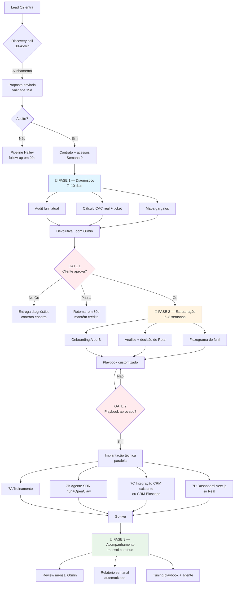
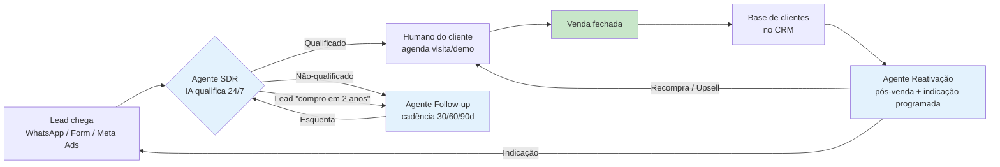

# Pacote 6OS — Produto Padrão Eloscope pro Público Q2

> **Uso duplo:**
> - **Seções públicas** (§1, §2, §3, §5, §6, §7, §10) — podem ser anexadas/incorporadas à proposta enviada ao cliente.
> - **Seções internas** (§4, §8, §9, §11, §12, §13) — para uso do time Eloscope. Marcadas com 🔒 INTERNO.
>
> **Status:** v1.1 (pós-sprint 18/04/2026)
> **Fonte-da-verdade raiz:** `../Sales_OS_Etapas_Entregaveis_v1.md` + este doc.
> **Relação com outros arquivos:** este é o consolidado. Para detalhes por dimensão, ver templates em `../templates/`.

---

## 1. O 6OS em 1 parágrafo (PÚBLICO)

**6OS (Sales Operating System)** é o produto padrão Eloscope para empresas de serviço com time comercial (Q2). Em 8–12 semanas instala o motor comercial completo: **diagnóstico → playbook → agentes de IA copiloto → CRM → dashboard → acompanhamento mensal**. A IA não substitui vendedor; destrava o gargalo antes dele (qualificação, follow-up, reativação de base). Premissa invariante: **nunca automatiza processo quebrado** — playbook é aprovado pelo cliente antes de qualquer agente rodar.

## 2. Para quem é o 6OS (PÚBLICO)

### Público-alvo: Q2 estrito (serviço com time comercial)

| Vertical Q2 | Ticket típico | Ciclo | Gargalo comum |
|---|---|---|---|
| **Imobiliária** | R$ 5–15k comissão | 30–90 dias | Lead frio não trabalhado; SDR inexistente |
| **Energia solar** | R$ 15–50k residencial · R$ 100–500k B2B | 30–120 dias | 70% lead não responde; base instalada inativa |
| **Clínica multi-profissional** (estética, vet, médica, fisio) | R$ 300–3k sessão | 7–30 dias | Recall, reagendamento, no-show |
| **Consultoria / Educação estruturada** | R$ 2–15k ticket | 15–60 dias | Follow-up manual; conversão em demo baixa |
| **Agência de marketing** | R$ 3–15k/mês contrato | 15–45 dias | SDR + case management |

### Requisitos mínimos de elegibilidade

- **Faturamento:** ≥ R$ 80k/mês
- **Time comercial:** ao menos 1 pessoa dedicada a conversar com lead
- **Abertura a IA como copiloto** (não como substituto)
- **Acesso disponível:** Meta Business, Google Ads (ou equivalente), planilha/CRM de vendas dos últimos 90 dias

### Fora do 6OS

Q1 (serviço sem time comercial) · Q3/Q4 (produto) · food delivery baixo-ticket · fotografia nicho · qualquer pedido de "software sob medida" sem encaixe na oferta padrão.

---

## 3. Três caminhos comerciais (PÚBLICO)

| Caminho | Quando oferecer | Duração | Investimento | Fidelidade |
|---|---|---|---|---|
| **🅰️ Diagnóstico standalone** | Lead ainda não mapeou dor; ou quer testar metodologia antes de contrato | 7–10 dias | **R$ 1.200 one-time** (100% vira crédito se virar Beta em 30d) | — |
| **🅱️ 6OS Beta** | Q2 com dor clara, fatura ≥ R$ 80k/mês, topa IA como copiloto | ~8 semanas até operar | **R$ 2.000–3.000 setup + R$ 1.500/mês** (+ case/depoimento como contrapartida) | 3 meses |
| **🅾️ 6OS Real** | Pós-case **ou** cliente com operação madura que quer stack próprio + dashboard dedicado | ~10–12 semanas até operar | **R$ 4.000–6.000 setup + R$ 3.000–5.000/mês** | 3 meses |

### Regra de decisão de caminho (PÚBLICO — pode aparecer na proposta como "por que te sugerimos X")

```
Lead Q2 elegível
   │
   ├─ Dor clara e mapeada? ─── Não → 🅰️ Diagnóstico standalone
   │                           Sim
   │                            │
   ├─ Operação já madura + dashboard/stack próprio? ─── Sim → 🅾️ Real
   │                                                   Não
   │                                                    │
   └─> 🅱️ Beta (padrão recomendado)
```

---

## 4. 🔒 INTERNO — Regras não-negociáveis da oferta

1. **Gate entre Fase 1 e Fase 2** — sem aceite formal do diagnóstico, não começa Fase 2.
2. **Gate entre playbook e agente IA** dentro da Fase 2 — sem aceite formal do playbook, nenhuma IA roda no cliente.
3. **Preço é range, não negociação.** Abaixo do range = anti-software-house violado.
4. **Desconto só com contrapartida** (case, depoimento, referência formal).
5. **Anti-lock-in:** playbook + workflows n8n + dados saem com o cliente se encerrar contrato.
6. **LGPD por default.** DPA padrão + RLS multi-tenant + guardrails de PII antes do go-live.
7. **Fidelidade mínima 3 meses** em Beta e Real.
8. **1 produto, 2 versões.** Sem criar Lite/Starter/Pro sob demanda. Demanda nova = atualizar esta fonte-da-verdade via PR.
9. **Gate de playbook vira "não" limpo** se cliente quiser pular. Não ceder — atrasa 2 semanas, evita 4 meses de retrabalho.

---

## 5. Fluxo macro de entrega (PÚBLICO — vai na proposta)

### Flowchart principal — do discovery ao go-live



### Flowchart operacional — como o lead do cliente anda no novo funil



---

## 6. Entregas por fase (PÚBLICO)

### Fase 1 — Diagnóstico (7–10 dias)

**Saída:** mapa comercial independente. Vale como produto mesmo se não virar 6OS.

| # | Entregável | Formato |
|---|---|---|
| 1.1 | Checklist do que já existe (playbook? scripts? materiais?) | Google Sheet |
| 1.2 | Mapa de canais + volume mensal | Tabela MD |
| 1.3 | Ticket médio real (observado, não declarado) | Tabela |
| 1.4 | Taxa de conversão por canal | Tabela + gráfico |
| 1.5 | Fluxograma do processo atual | Mermaid + PNG |
| 1.6 | 3–5 gargalos priorizados com R$ perdidos estimados | MD |
| 1.7 | Devolutiva Loom 60min + link permanente | Vídeo |
| 1.8 | Documento de diagnóstico final | PDF + Google Doc |

**Critério de aceite (Gate 1):** cliente assistiu devolutiva + assinou aceite por email + decidiu Go / No-Go / Pausa.

### Fase 2 — Estruturação (6–8 semanas Beta · 10–12 Real)

**Saída:** operação comercial rodando com playbook + agentes + CRM + time treinado.

| # | Entregável | Beta | Real |
|---|---|---|---|
| 2.1 | Onboarding A (form) ou B (OpenClaw + WhatsApp) | ✅ | ✅ |
| 2.2 | Decisão de Rota R1 (refinar atual) ou R2 (processo novo) | ✅ | ✅ |
| 2.3 | Fluxograma do funil aprovado | ✅ | ✅ |
| 2.4 | Playbook de vendas (base + custom) | ✅ | ✅ |
| 2.5 | Ata do Gate 2 (playbook aprovado) | ✅ | ✅ |
| 2.6 | 7A Treinamento gravado (Loom) | opcional | ✅ |
| 2.7 | 7B Agente SDR em n8n + OpenClaw | ✅ core | ✅ |
| 2.8 | 7C Integração CRM existente OU CRM Eloscope multi-tenant | CRM Eloscope padrão | ✅ integração |
| 2.9 | 7D Dashboard Next.js + Tailwind + Clerk | upsell | ✅ incluído |
| 2.10 | Handoff operacional doc (quem chama quem) | ✅ | ✅ |

**Critério de aceite (Gate 2):** agentes em produção 5d úteis + 3 atendimentos reais feitos + métricas baseline capturadas + time opera sem Eloscope no grupo 24/7.

### Fase 3 — Acompanhamento (contínuo, mínimo 3 meses)

**Saída:** operação saudável, evoluindo mês a mês.

| Ritual | Frequência | Formato | Dono |
|---|---|---|---|
| Review mensal de métricas | 1×/mês | Call 60min + ata | Lucas |
| Relatório semanal automatizado | Toda segunda 08h | Email + dashboard | Agente IA |
| Ajustes de playbook (PR) | Mensal ou sob demanda | Approval cliente | Hugo |
| Tuning de agente (prompts, skills) | Sob demanda | Staging antes prod | Victor |
| NPS trimestral | Mês 3 / 6 / 9 / 12 | Form | Hugo |

---

## 7. Cronograma padrão (PÚBLICO)

### Versão Beta — 8 semanas

```mermaid
gantt
    title 6OS Beta — Padrão Q2
    dateFormat X
    axisFormat S%w

    section Fase 1
    Diagnóstico                 :f1, 0, 10d
    Gate 1                      :milestone, 10, 0d

    section Fase 2
    Onboarding A/B              :f2a, 10, 5d
    Análise + Rota + Funil      :f2b, 15, 5d
    Playbook                    :f2c, 20, 10d
    Gate 2                      :milestone, 30, 0d
    7B Agente SDR + WABA        :f2d, 30, 10d
    Treinamento + Handoff       :f2e, 40, 5d

    section Fase 3
    Go-live + operação          :f3, 45, 15d
```



### Versão Real — 10–12 semanas

```mermaid
gantt
    title 6OS Real — Padrão Q2
    dateFormat X
    axisFormat S%w

    section Fase 1
    Diagnóstico                 :f1, 0, 10d
    Gate 1                      :milestone, 10, 0d

    section Fase 2
    Onboarding + Análise        :f2a, 10, 10d
    Playbook                    :f2b, 20, 10d
    Gate 2                      :milestone, 30, 0d
    7B Agente SDR               :f2c, 30, 10d
    7C Integração CRM           :f2d, 30, 15d
    7D Dashboard Next.js        :f2e, 35, 20d
    Treinamento + Go-live       :f2f, 55, 5d

    section Fase 3
    Operação                    :f3, 60, 15d
```



### Milestones invariantes

| # | Marco | Quando | Dono aceite |
|---|---|---|---|
| M0 | Assinatura contrato + acessos | Semana 0 | Cliente |
| M1 | Devolutiva Loom Fase 1 | Semana 1-2 | Eloscope |
| **M2** | **Gate 1 aprovado** | Fim Fase 1 | **Cliente** |
| M3 | Playbook entregue | Semana 4 (Beta) / 5 (Real) | Eloscope |
| **M4** | **Gate 2 aprovado** | Fim do playbook | **Cliente** |
| M5 | Agentes em produção | Semana 6 (Beta) / 9 (Real) | Eloscope |
| M6 | Go-live + handoff | Semana 8 (Beta) / 12 (Real) | Ambos |
| M7 | Review mensal 1 | +30d pós go-live | Ambos |

Detalhe parametrizável por cliente: [`../templates/Cronograma_Cliente_Template.md`](../templates/Cronograma_Cliente_Template.md)

---

## 8. 🔒 INTERNO — Stack canônico (por função)

| Camada | Ferramenta | Obrigatória | Observação |
|---|---|---|---|
| Canal cliente-final | **WhatsApp Business API (Meta)** | Sim | Aprovação Meta 3–10d — caminho crítico |
| Automação cliente-final | **n8n** (self-hosted Eloscope) | Sim | Estável, templates prontos |
| Inteligência interna | **OpenClaw / OpenCloud** | Sim | Só fala com cliente final no onboarding B |
| Persistência | **Supabase** (Postgres + RLS) | Sim | Tier free até ~50k req; Pro R$125/mês |
| CRM — modo A | **Eloscope multi-tenant** (React + n8n) | Default Beta | Custo dev único já pago |
| CRM — modo B | **Integração HubSpot/Pipedrive/RD/Kommo** | Só Real (ou cliente legado) | Anti-SH: 3+ clientes = feature; <3 = custo extra |
| Frontend dashboard | **Next.js + Tailwind v4 + shadcn + Clerk** | Só Real (7D) | Custo-time alto — por isso upsell |
| Docs / handoff | **Notion, Google Docs, Loom** | Sim | — |
| Diagramas | **Mermaid em Miro / FigJam** | Sim | — |
| Gravação de call | **Fireflies (principal) + Fathom (secundário)** | Sim | — |
| 🚧 Em teste | **Paperclip** | **Não entra no Beta** | Contrato separado se validar |

Detalhe: [`../templates/Custos_Stack_Template.md`](../templates/Custos_Stack_Template.md)

---

## 9. 🔒 INTERNO — Tempos, horas e margem

### Por fase (dias úteis)

| Fase / Sub-etapa | Mín | Típico | Máx | Fator que estica |
|---|---|---|---|---|
| Fase 1 Diagnóstico | 5 | 7 | 10 | Cliente sem acesso centralizado |
| Onboarding A | 2 | 3 | 5 | Cliente atrasa credencial |
| Onboarding B (OpenClaw) | 3 | 5 | 7 | Cliente bagunçado |
| Análise + Rota | 2 | 3 | 5 | Dado Fase 1 incompleto |
| Fluxograma funil | 1 | 2 | 3 | Mais de 5 canais |
| Playbook | 5 | 7 | 10 | Cliente escreve junto |
| Gate formal | 1 | 2 | 5 | Agenda do dono |
| 7A Treinamento | 2 | 3 | 5 | Rotatividade do time |
| 7B Agente SDR | 5 | 8 | 15 | **WABA approval 5d bloqueantes** |
| 7C Integração CRM | 3 | 6 | 15 | API do CRM (Kommo ok, customizado = dor) |
| 7D Dashboard | 7 | 14 | 25 | Design review + revisão cliente |
| Review mensal | 1 | 1 | 2 | Alteração de playbook no meio |

### Por ferramenta (setup + operação/mês)

| Ferramenta | Setup (h) | Op (h/mês) | Quem |
|---|---|---|---|
| n8n workflows | 8–16 | 2–4 | Victor |
| OpenClaw | 12–24 | 3–6 | Victor |
| Supabase | 4–8 | 1–2 | Victor |
| WABA | 6–12 + **3–5d bloqueante Meta** | 0,5 | Victor + cliente |
| CRM Eloscope | 4–8 | 1–2 | Victor |
| CRM integração | 8–20 | 2–4 | Victor |
| Playbook | 20–40 | 2–4 tuning | Lucas + Hugo |
| Treinamento | 8–12 | 0 | Lucas |
| Dashboard 7D | 40–80 | 4–8 | Victor |
| Clerk | 4 | 0,5 | Victor |

### Custo-time e margem (hora-time média Eloscope R$ 150/h)

#### Beta — ciclo de 3 meses

| Item | Valor |
|---|---|
| Receita (midpoint) | R$ 2.500 setup + 3 × R$ 1.500 = **R$ 7.000** |
| Custo-time (30h F1 + 110h F2 + 30h F3) × R$150 | **R$ 25.500** |
| **Margem Beta isolada** | **Negativa — investimento em case** |

> Payback do Beta vem de: (a) conversão Beta → Real, (b) reuso de playbook em clientes seguintes, (c) case destrava próxima venda sem Beta gratuito.

#### Real — ciclo de 12 meses

| Item | Valor |
|---|---|
| Receita | R$ 5.000 setup + 12 × R$ 4.000 = **R$ 53.000** |
| Custo-time (30h F1 + 160h F2 + 180h F3) × R$150 | **R$ 55.500** |
| **Margem Real isolada** | **Estreita — depende de padronização e N clientes simultâneos** |

**Conclusão:** margem saudável é sistêmica (padronização + escala), não unitária. Reforça a regra anti-software-house.

Detalhe: [`../templates/Tempo_Template.md`](../templates/Tempo_Template.md)

---

## 10. Custos e transparência ao cliente (PÚBLICO)

### O que o cliente paga pra Eloscope

| Caminho | Setup one-time | Mensal | Fidelidade |
|---|---|---|---|
| 🅰️ Diagnóstico | R$ 1.200 | — | — |
| 🅱️ Beta | R$ 2.000–3.000 | R$ 1.500 | 3 meses |
| 🅾️ Real | R$ 4.000–6.000 | R$ 3.000–5.000 | 3 meses |

### O que o cliente paga direto pra terceiros (transparência)

| Item | Faixa mensal estimada |
|---|---|
| WhatsApp conversations (Meta) | R$ 50 (Beta) – R$ 2.000 (Real volume alto) |
| Supabase Pro (só se estourar tier free) | ~R$ 125/mês |
| Vercel Pro (só dashboard 7D) | ~R$ 80/mês |
| Clerk Pro (só dashboard 7D) | ~R$ 125/mês |
| CRM existente do cliente (se 7C) | R$ 100–2.000/mês (já paga hoje) |
| Google Ads / Meta Ads | **sem mudança — mantém orçamento atual** |

### Regras de preço

1. Preço é **range**, não ponto. Entra dentro do range conforme porte do cliente e complexidade.
2. **Desconto só com contrapartida formal** (case, depoimento, uso de marca).
3. **Custos de terceiros listados ao cliente antes do contrato.** Sem surpresa.
4. **Revisão trimestral** de preços de SaaS e hora-time.
5. **Paperclip fora do Beta.** Se entrar, contrato separado.

---

## 11. 🔒 INTERNO — O que NÃO fazer (anti-software-house)

| Pedido do cliente | Cabe no 6OS? | O que fazer |
|---|---|---|
| "Quero um site novo" | ❌ | Contrato acessório pós-go-live |
| "Quero SEO + blog" | ❌ | Contrato acessório (sub-produto Hélio/Nova) |
| "Quero personagem famoso na publicidade" | ❌ | Fora do escopo Eloscope — indicar parceiro |
| "Quero app mobile" | ❌ | Anti-software-house — recusa limpa |
| "Quero integrar com ERP customizado" | ⚠️ | Só se aparecer em 3+ clientes; senão contrato extra |
| "Quero chat no site" | ⚠️ | Só se for omnichannel integrado ao fluxo — senão fora |
| "Quero dashboard Real logo no Beta" | ⚠️ | Upsell pra Real ou bloco adicional com preço separado |
| "Quero pagar menos do que o range mínimo" | ❌ | Não. Acima do range só com mais escopo; abaixo não. |

### Filtro anti-software-house (3 testes)

1. **Aparece em 3+ clientes?** → vira feature multi-tenant do 6OS.
2. **É single-client não-padrão?** → contrato separado, não embute no mensal.
3. **Em dúvida?** → não constrói. "Não" é uma resposta válida.

---

## 12. 🔒 INTERNO — Mapa de árvore de templates (pra navegar)

Todos em `../templates/`:

| Template | Usado em | Quando abrir |
|---|---|---|
| [Proposta_Lead_Template.md](../templates/Proposta_Lead_Template.md) | Proposta enviada ao cliente | Toda venda |
| [Proposta_Valor_Template.md](../templates/Proposta_Valor_Template.md) | Seção §3 da proposta (VPC por vertical) | Por vertical Q2 |
| [Processo_Entrega_Template.md](../templates/Processo_Entrega_Template.md) | Seção §5 da proposta (mapa de entrega) | Toda venda |
| [Cronograma_Cliente_Template.md](../templates/Cronograma_Cliente_Template.md) | `cronograma.md` por cliente | Pós-aceite |
| [Tempo_Template.md](../templates/Tempo_Template.md) | Validação de prazo | Antes do contrato |
| [Custos_Stack_Template.md](../templates/Custos_Stack_Template.md) | Seção §9 da proposta (custos) | Toda venda |
| [Objecoes_Matriz_Template.md](../templates/Objecoes_Matriz_Template.md) | Seção §11 da proposta + call ao vivo | Pré-call |
| [Lead_Profile_Template.md](../templates/Lead_Profile_Template.md) | `lead-profile.md` por cliente | Pré-discovery |

### Artefatos no `docs/`

| Arquivo | Função |
|---|---|
| [Oferta_Padrao.md](./Oferta_Padrao.md) | Índice curto de 1 tela — navegação rápida |
| **Pacote_6OS_Q2.md** (este) | Dossiê consolidado — anexo de proposta + manual do time |
| [Pipeline.md](./Pipeline.md) | Tabela mestre dos 46 leads |
| [Cobertura_Entrega.md](./Cobertura_Entrega.md) | Gap-check matriz fase × dimensão |

---

## 13. 🔒 INTERNO — Quando atualizar este doc

Dispara PR + changelog curto quando:
- Preço mudar (range ou valor)
- Nova ferramenta entrar/sair do stack
- Vertical novo validado além dos 5 Q2
- Nova versão do produto (exige aprovação Lucas + Victor)
- Regra invariante mudar

### Changelog

- **2026-04-19 (v1.1):** documento criado consolidando `Oferta_Padrao.md` + `Processo_Entrega_Template.md` + `Tempo_Template.md` + `Custos_Stack_Template.md` + flowcharts inéditos (macro + funil cliente).

---

## Anexo A — Seções públicas recortadas pra proposta

Copiar/anexar ao `proposta.md` de cada lead:

- **§1** — O 6OS em 1 parágrafo
- **§2** — Para quem é
- **§3** — Três caminhos comerciais
- **§5** — Fluxo macro de entrega (flowcharts Mermaid)
- **§6** — Entregas por fase
- **§7** — Cronograma padrão
- **§10** — Custos e transparência

Notar: estas seções são **genéricas Q2**. A proposta do lead específico **customiza** por vertical (solar, imobiliária, clínica, etc.) puxando do `Proposta_Valor_Template.md` + `Objecoes_Matriz_Template.md`.
