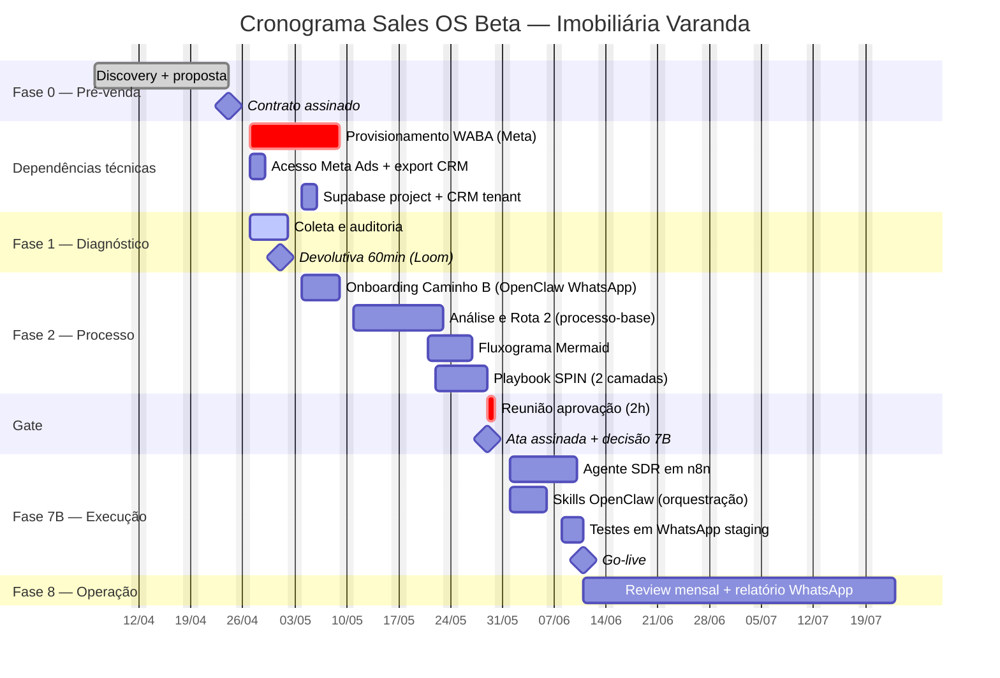

# Cronograma — Imobiliária Varanda (exemplo didático)

**Versão:** 0.1
**Data de emissão:** 2026-04-19
**Kickoff previsto:** 2026-04-27 (segunda-feira)
**Rota:** 2 — cliente não tem processo claro; material de venda solto em Drive sem scripts padronizados
**Pacote contratado:** Beta (R$2.500 setup + R$1.500/mês × 3 meses)
**Camada de execução (Etapa 7):** 7B — Agente SDR em n8n com OpenClaw como orquestrador interno

> **Natureza deste doc:** exemplo didático preenchido a partir da v1.0 do planejamento (`Planejamento/Sales_OS_Etapas_Entregaveis_v1.md`). Cliente fictício (imobiliária mid-ticket, 15 corretores em SP, ticket médio R$650k, ciclo 45-60 dias) para validar o template e rodar o `schedule-validator` num caso concreto antes de usar em cliente real.

---

## 1. Resumo executivo

- **Duração total (kickoff → operar):** 7 semanas (20/04 → 08/06/2026)
- **Gate formal:** 29/05/2026 (semana 6) — decisão go/no-go antes de qualquer automação
- **Primeiro marco de valor ao cliente:** diagnóstico entregue em 01/05 (semana 1), com devolutiva gravada no Loom que fica com o cliente mesmo se ele não fechar Sales OS
- **Stack de execução travada:** n8n (ação com cliente final no WhatsApp) + OpenClaw (inteligência interna, crons, relatório via WhatsApp) + Supabase (persistência) + CRM próprio Eloscope multi-tenant + WhatsApp Business API Meta. Sem dashboard web (não se justifica pelos critérios da v1.0 — cliente acessa relatório via WhatsApp).

---

## 2. Gantt (Mermaid)



**Notas de leitura:**
- **WABA (10d úteis)** é o caminho crítico — começa no kickoff e pode atrasar 7B se deslizar. Monitorar semanalmente.
- **Rota 2 adiciona 1 semana** em Análise (f3a = 10d vs 5d da rota 1) — previsto no cronograma.
- **Sem barra 7D** porque cliente não pediu dashboard web e não se enquadra em nenhum dos 3 critérios da v1.0 (múltiplos usuários, visualização complexa, reporting formal).
- **Skills OpenClaw do setup** cobrem só orquestração básica (crons, escalonamento pra humano, relatório semanal). Lead scoring e previsão entram na Etapa 8 organicamente.

---

## 3. Tabela de marcos

| # | Marco | Data alvo | Responsável | Pré-requisito | Evidência |
|---|---|---|---|---|---|
| M0 | Contrato assinado | 24/04 | Comercial Eloscope | Proposta Beta aceita | PDF Clicksign |
| M1 | Diagnóstico entregue | 01/05 | Consultor + material da Etapa 1 | Acesso Meta Ads + export CRM | Doc auditoria + Loom devolutiva |
| M2 | Onboarding concluído | 08/05 | OpenClaw (Caminho B) + consultor | Grupo WhatsApp criado | Dataset no Supabase + ata |
| M3 | Rota 2 definida | 21/05 | Consultor Eloscope | Dataset M2 + 3-5 concorrentes pesquisados | Doc "Processo-Base Proposto" |
| M4 | Fluxograma aprovado | 24/05 | `playbook-writer` + consultor | M3 | .mmd commitado + PNG no Miro |
| M5 | Playbook entregue | 26/05 | `playbook-writer` | M4 + template base do repo | Playbook.md + templates de mensagem |
| **M6** | **GATE — Go/No-go** | **29/05** | Cliente + Eloscope | M4 + M5 + ata preparada | **Ata .md assinada, escolha 7B confirmada** |
| M7 | 7B em produção | 11/06 | Dev Eloscope | M6 = go + WABA ativa + Supabase ok | Agente rodando no WhatsApp cliente |
| M8 | Operação iniciada | 11/06 | Ops Eloscope | M7 | Review mensal agendado + relatório semanal no WhatsApp do cliente |

---

## 4. Dependências de ferramenta

| Dependência | Obrigatório para | Início previsto | Responsável | Status |
|---|---|---|---|---|
| Acesso leitura Meta Ads Manager | Etapa 1 | 27/04 | Cliente | Pendente |
| Export CRM atual (Kommo, típico imobiliária) | Etapa 1 | 27/04 | Cliente | Pendente |
| Meta Business API (WABA) | 7B | 27/04 (10d úteis) | Cliente + Eloscope | Pendente — **caminho crítico** |
| Supabase project (multi-tenant existente) | 7B, 8 | 04/05 | Eloscope | Infra já existe; criar tenant novo |
| CRM próprio Eloscope (tenant do cliente) | Etapa 2+ | 04/05 | Eloscope | Multi-tenant já contemplado no CRM |
| VPS/servidor OpenClaw | Etapa 2 (Caminho B) e 7B | 04/05 | Eloscope | Servidor compartilhado — skill nova por cliente |
| Notion workspace compartilhado | Etapas 2-8 | 27/04 | Eloscope | Template pronto |
| Fireflies capturando Gate | Etapa 6 | 29/05 | Eloscope | Integração já ativa |

---

## 5. Regras de replanejamento aplicadas

1. **Se WABA não sair até 04/05 (1 semana após kickoff):** escalar no grupo do cliente, considerar empurrar M7 sem mexer no Gate — Gate pode acontecer sem WABA, mas 7B não vai ao ar.
2. **Rota 2 já contempla +1 semana na Análise.** Se concorrentes não estiverem mapeados até 18/05, segurar fluxograma.
3. **Se cliente não liberar acesso Meta Ads/CRM até 29/04:** Etapa 1 trava. Não montar diagnóstico com suposição.
4. **Deslize >3 dias em M1 ou M6:** aviso formal ao cliente com nova data e motivo.

---

## 6. Escopo explícito (anti-software-house aplicado)

**Dentro do Beta:**
- Agente SDR em n8n baseado em template Eloscope existente (padrão para imobiliária)
- OpenClaw rodando orquestração + relatório semanal via WhatsApp
- Tenant novo no CRM próprio Eloscope (sem dev custom)
- Playbook customizado na camada 2 (scripts, objeções, cadências) usando template base

**Fora do Beta (vira proposta separada se cliente pedir):**
- Dashboard web custom — não se justifica pelos critérios v1.0
- Integração com Kommo existente — viola anti-software-house se exigir >3d dev; mais barato migrar para CRM próprio
- Trilha educacional gravada (R$1.800 upsell)
- Site ou landing page (Etapa 9, contrato à parte)

---

## 7. Validação pendente

Rodar agora:

```
use o schedule-validator para checar docs/clientes/exemplo-imobiliaria-varanda/cronograma.md
```

O parecer deve apontar zero violações duras se o cronograma estiver bem — e servir de benchmark para validar cronogramas reais daqui pra frente.

---

**Este doc é exemplo didático.** Quando houver primeiro cliente Beta real, copiar este arquivo para `docs/clientes/[nome-real]/cronograma.md` e parametrizar datas + vertical + especificidades.
