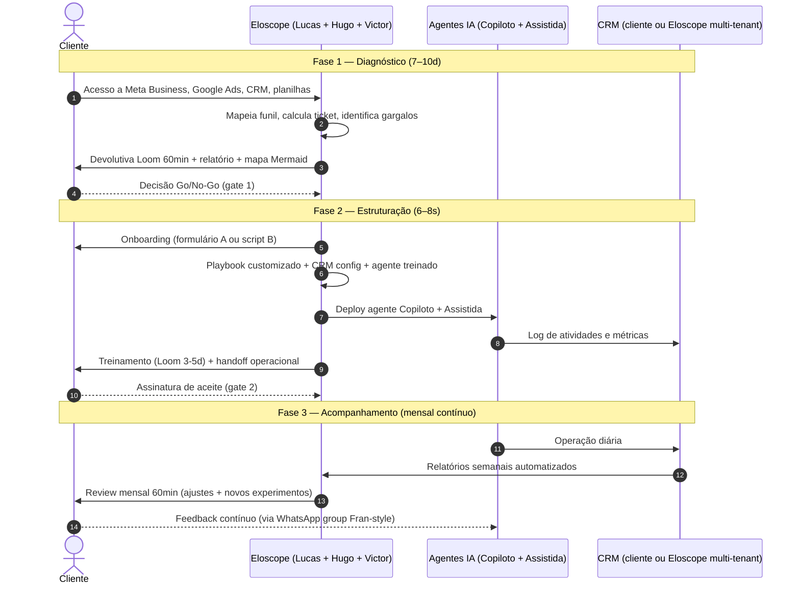

# Processo de Entrega — 6OS

**Fonte:** reunião 18/04/2026. 3 fases aprovadas, estrutura modular por versão (Beta / Real).
**Objetivo do documento:** mapa fim-a-fim sem gap. Cada fase tem entregável nomeado, dono, input esperado do cliente e critério de aceite. Se alguma célula estiver vazia, é gap consciente — `Cobertura_Entrega.md` rastreia.

## Visão macro — 3 fases

| Fase | Nome | Duração | Produto entregue | Gate formal? |
|---|---|---|---|---|
| **1** | Diagnóstico | 7–10 dias (até 14d se cliente bagunçado) | Relatório comercial + devolutiva Loom 60min | Sim — go/no-go pra Fase 2 |
| **2** | Estruturação | 6–8 semanas | Playbook aprovado + agentes IA rodando + CRM organizado + treinamento | Sim — go/no-go pra Fase 3 operar sozinho |
| **3** | Acompanhamento | Contínuo (mínimo 3 meses de contrato) | Review mensal + relatórios semanais + ajustes de playbook/agente | — (pode encerrar sob 30d-aviso) |

## Diagrama sequence (Mermaid)

## Fase 1 — Diagnóstico

**Objetivo:** entregar ao cliente um mapa do processo comercial dele que independe da Eloscope. Vale como produto próprio mesmo se cliente não contratar 6OS.

### Entregáveis

| # | Artefato | Formato | Dono Eloscope | Input do cliente |
|---|---|---|---|---|
| 1.1 | Checklist do que existe (playbook? scripts? material? processo doc?) | Google Sheet preenchido | Hugo | Acesso a Drive + entrevista de 30min com dono |
| 1.2 | Mapeamento de canais e volume mensal | Tabela em markdown | Hugo | Acesso a Meta Business + Google Ads + Analytics |
| 1.3 | Ticket médio real (observado, não declarado) | Tabela | Hugo | Acesso a NF/ERP ou planilha de vendas dos últimos 90 dias |
| 1.4 | Conversão por canal | Tabela + gráfico | Hugo | Mesmo do 1.2 e 1.3 |
| 1.5 | Mapa do processo atual (fluxograma por canal) | Mermaid + PNG | Lucas | Entrevista de 45min com cada papel (vendedor, SDR se houver, atendente) |
| 1.6 | Identificação de gargalos com estimativa de R$ perdidos | Markdown com 3–5 gargalos priorizados | Lucas | — (sai do cruzamento dos itens acima) |
| 1.7 | Devolutiva gravada (Loom 60min) | Vídeo + link permanente | Lucas | Cliente assiste e devolve perguntas escritas em até 5d |
| 1.8 | Documento de diagnóstico final (entrega comercializável) | PDF + Google Doc | Hugo (Lucas revisa) | Aprovação formal do cliente |

### Critério de aceite da Fase 1 (gate 1)

- [ ] Cliente recebeu os 8 artefatos acima
- [ ] Cliente assistiu a devolutiva e fez perguntas
- [ ] Cliente assinou "aceito o diagnóstico" (e-mail basta)
- [ ] Decisão formalizada: **Go (segue pra Fase 2)** / **No-Go (encerra, diagnóstico fica com cliente)** / **Pausa (retomar em até 30d, mantém crédito)**

### Quem toca

- **Lead:** Lucas (comercial + fechamento)
- **Execução:** Hugo (coleta + análise)
- **Revisão:** Victor (só se houver dúvida técnica)
- **Tempo-time estimado:** 20–30h total

### Pricing Fase 1 isolada

R$ 1.200 one-time (de v1.0; sprint não refez o número). Se virar 6OS Beta em até 30d, vira crédito de 100% no setup do Beta.

## Fase 2 — Estruturação

**Objetivo:** transformar o mapa da Fase 1 em operação. Playbook + CRM + agentes + treinamento.

### Sub-etapas internas (ordem)

1. **Onboarding (3–7 dias)** — capturar dados operacionais que faltaram.
   - Caminho A: formulário estruturado + cliente compartilha credenciais (cliente organizado)
   - Caminho B: OpenClaw + WhatsApp conduzem o cliente conversacional (cliente bagunçado). A ferramenta **educa enquanto coleta** — é o único momento de Fase 2 que OpenClaw fala direto com cliente.
2. **Análise & Rota (3–5 dias)** — decidir Rota 1 (só mapear e refinar o processo atual) ou Rota 2 (desenhar processo-base novo junto com o cliente).
3. **Fluxograma de funil (2–3 dias)** — Mermaid versionado + PNG. Aprovação do cliente antes de avançar.
4. **Playbook de vendas (5–10 dias)** — camada base reutilizável + camada custom (scripts por estágio, cadências, matriz de objeções, regras SDR↔closer).
5. **Gate formal (2–5 dias)** — reunião de 2h pra aprovar playbook. Ata assinada. **Sem esse gate não avança pra implantação.**
6. **Implantação (1–4 semanas, modular)**:
   - **7A Treinamento** — Loom de 3–5d se cliente só quer playbook + treino.
   - **7B Agente SDR em n8n + OpenClaw** — 1–2 semanas. É o core do Beta.
   - **7C Integração com stack existente** (HubSpot/Pipedrive/RD/Kommo) — 1–2 semanas. Só se cliente já usa e não quer migrar.
   - **7D 7B + dashboard Next.js** — 2–4 semanas. Versão Real ou upsell do Beta.

### Entregáveis da Fase 2

| # | Artefato | Dono | Critério de aceite |
|---|---|---|---|
| 2.1 | Dataset onboarding completo | Hugo | Todos os campos do formulário/script preenchidos |
| 2.2 | Decisão de Rota (R1 ou R2) assinada | Lucas | Email do cliente confirmando |
| 2.3 | Fluxograma de funil Mermaid versionado | Lucas | Cliente aprova em reunião |
| 2.4 | Playbook de vendas (base + custom) | Lucas + Hugo | Cliente aprova em gate formal |
| 2.5 | Ata do gate (go/no-go pra implantação) | Hugo | Ata PDF assinada digitalmente |
| 2.6 | Agentes em produção (Copiloto + Assistida) | Victor | Agente responde em < 3s em 95% dos casos de teste |
| 2.7 | CRM config (multi-tenant Eloscope ou integração) | Victor | Cliente consegue abrir e ver seu pipeline |
| 2.8 | Treinamento gravado | Lucas | Time do cliente assistiu + deu feedback |
| 2.9 | Handoff doc de operação | Hugo | Cliente sabe quem chamar pra quê |

### Critério de aceite da Fase 2 (gate 2)

- [ ] Agentes rodando em ambiente de produção há pelo menos 5 dias úteis
- [ ] Cliente conseguiu completar 3 atendimentos reais usando o novo playbook
- [ ] Métricas baseline capturadas (pré-6OS) pra comparação depois
- [ ] Time do cliente sabe operar sem Eloscope no WhatsApp 24/7

### Quem toca

- **Lead:** Lucas (playbook + gate)
- **Execução técnica:** Victor (agente, n8n, CRM)
- **Operação:** Hugo (onboarding + treinamento + handoff)
- **Tempo-time estimado:** 80–150h (varia por 7A/B/C/D)

## Fase 3 — Acompanhamento

**Objetivo:** garantir que a operação funciona e gera resultado. Ajustar playbook/agente mensalmente. Detectar e corrigir desvio.

### Rituais

| Ritual | Frequência | Formato | Dono | Duração |
|---|---|---|---|---|
| Revisão mensal de métricas | Mensal | Call 60min + doc | Lucas | 60min |
| Relatório semanal automatizado | Semanal | E-mail + dashboard | Agente IA | Automatizado |
| Ajuste de playbook | Mensal ou sob demanda | PR no playbook + aprovação cliente | Hugo | — |
| Tuning de agente (prompts, skills) | Sob demanda | Deploy em staging primeiro | Victor | — |
| WhatsApp group Fran-style (feedback quente) | Diário | Mensagem curta | Time Eloscope | 15min/dia |
| Ampliação de skill OpenClaw | Mensal | Nova skill sobe por PR | Victor | — |

### Entregáveis mensais

| # | Artefato | Dono | SLA |
|---|---|---|---|
| 3.1 | Relatório mensal de performance | Lucas | Até dia 5 do mês seguinte |
| 3.2 | Relatório semanal automatizado | Agente | Toda segunda 08h |
| 3.3 | Ata da review mensal | Hugo | Até 48h pós-call |
| 3.4 | Ajustes deployados | Victor | Sob demanda, staging antes de prod |
| 3.5 | NPS trimestral | Hugo | Mês 3, 6, 9, 12 |

### Critério de saída (Fase 3)

A Fase 3 é contínua. O cliente sai quando:
- Contrato chega ao fim (mínimo 3 meses) e não renova (aviso de 30d)
- Cliente fica "independente" e quer reduzir escopo — vira Lite (R$500–800/mês só pra monitor + ajuste anual)
- Eloscope encerra por churn risk (cliente não usa — 3 meses sem engajamento = oferta de redução ou encerramento)

### Quem toca

- **Lead:** Lucas (review mensal)
- **Operação:** Hugo (ajustes + playbook)
- **Técnico:** Victor (agentes + infra)
- **Tempo-time estimado:** 10–20h/mês por cliente

## Matriz de cobertura por versão

| | Beta | Real |
|---|---|---|
| Fase 1 Diagnóstico | Incluso no setup | Incluso no setup |
| Fase 2 Estruturação (sub-etapa 7A) | Opcional | Incluso |
| Fase 2 Estruturação (sub-etapa 7B) | **Incluso** (core do Beta) | Incluso |
| Fase 2 Estruturação (sub-etapa 7C) | Sob demanda (+R$) | Incluso se cliente tem stack |
| Fase 2 Estruturação (sub-etapa 7D) | Fora (upsell) | Incluso |
| Fase 3 Acompanhamento mensal | R$1.500/mês | R$3.000–5.000/mês |
| Fidelidade mínima | 3 meses | 3 meses |

## Handoff entre fases — contratos-duros

- **Fase 1 → Fase 2:** só avança com ata assinada de aceite do diagnóstico + proposta 6OS assinada
- **Fase 2 → Fase 3:** só avança com agentes rodando 5d úteis + treinamento gravado + time do cliente validado
- **Dentro da Fase 2:** gate formal entre planejamento (playbook) e implantação — **esta é a regra dura que impede automatizar processo quebrado**

## Princípios invariantes

1. **Nada de automação antes da Fase 2 gate aprovado.** Protege cliente e margem.
2. **Artefato ou não aconteceu.** Toda fase termina com doc versionado.
3. **Um handoff por vez.** Não sobrepõe Fase 2 com Fase 3 pra "acelerar".
4. **Cliente sabe quem falar com quem.** Handoff doc da Fase 2 é obrigatório — sem ele, Fase 3 vira caos.
5. **Anti-software-house.** Customização acima do padrão vira contrato separado, não fica embutida na mensalidade.
