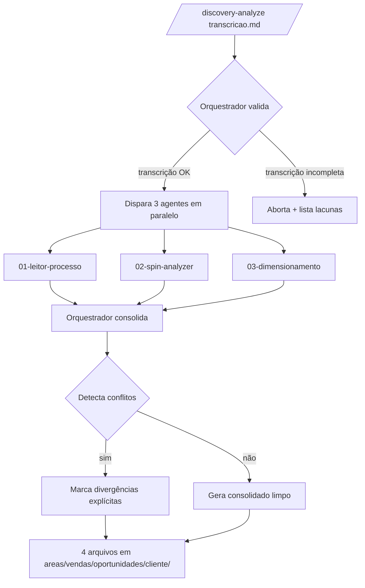

# Discovery Analyzer Squad

> Squad que pega uma transcrição de discovery comercial (já capturada pela skill [[skills/reuniao/SKILL|/reuniao]]) e produz **3 análises complementares** + **1 relatório consolidado** prontos para o vendedor levar pra apresentação ou orçamento.

## 1. Visão geral

| Item | Valor |
|------|-------|
| **Quando usar** | Após uma reunião de discovery comercial ter sido transcrita e salva em `areas/vendas/oportunidades/{cliente}/transcricao-*.md`. |
| **Quem invoca** | Vendedor (Lucas, Hugo, Vítor) ou skill [[skills/discovery-analyze/SKILL\|/discovery-analyze]]. |
| **Tempo estimado** | 5-10 min em paralelo (vs. 60-90 min manual). |
| **Output final** | 4 arquivos markdown na pasta do cliente: `analise-processo-{cliente}.md`, `analise-spin-{cliente}.md`, `analise-dimensionamento-{cliente}.md`, `analise-consolidada-{cliente}.md`. |
| **Pré-requisito** | Transcrição em markdown com falas atribuídas (cliente vs. vendedor). |

> [!info] Posicionamento no funil
> Esta squad fica **entre a reunião e o orçamento**. Ela não substitui o vendedor — ela enxerga padrões e números que o vendedor perderia lendo cru.

---

## 2. Decisão arquitetural — Paralelo + Orquestrador

### Escolha: **Execução em paralelo, consolidação centralizada**

```
                ┌────────────────────────┐
                │  /discovery-analyze    │
                │   {transcricao.md}     │
                └───────────┬────────────┘
                            │
                            ▼
               ┌─────────────────────────┐
               │   00-orquestrador       │
               │   (Cassandra)           │
               │   • valida transcrição  │
               │   • dispara 3 em ||     │
               │   • consolida + media   │
               │     conflitos           │
               └─┬────────┬────────┬─────┘
                 │        │        │
        ┌────────┘        │        └────────┐
        ▼                 ▼                 ▼
 ┌─────────────┐  ┌──────────────┐  ┌──────────────────┐
 │ 01-leitor   │  │ 02-spin      │  │ 03-dimensiona-   │
 │   processo  │  │   analyzer   │  │   mento          │
 │             │  │              │  │                  │
 │ Fluxograma  │  │ SPIN +       │  │ Números, perdas, │
 │ canais →    │  │ completude   │  │ ROI, payback,    │
 │ atendimento │  │ + briefings  │  │ capacidade       │
 │ → conversão │  │ apresentação │  │ vs demanda       │
 │             │  │ + orçamento  │  │                  │
 └──────┬──────┘  └──────┬───────┘  └────────┬─────────┘
        │                │                   │
        └────────────────┼───────────────────┘
                         ▼
              ┌──────────────────────┐
              │  00-orquestrador     │
              │  consolida →         │
              │  analise-consolidada │
              │  + flag de conflitos │
              └──────────────────────┘
```

### Por que paralelo (e não sequencial)?

| Critério | Paralelo (escolhido) | Sequencial |
|----------|---------------------|-----------|
| **Velocidade** | 3 agentes ao mesmo tempo, ~5 min total | 3x mais lento, ~15 min |
| **Independência cognitiva** | Cada agente vê a transcrição com olhar fresco — não enviesa pelo output anterior | Risco de o SPIN herdar erros do Leitor; o Dimensionamento herdar inferências do SPIN |
| **Detecção de divergência** | Se os 3 chegam em conclusões iguais, alta confiança. Se divergem, sinal de transcrição ambígua | Divergências escondidas porque cada um valida o anterior |
| **Anti-alucinação** | Cada agente tem ground truth próprio (a transcrição). Não pode "alucinar baseado no que o anterior disse" | Cadeia de inferências amplifica alucinação |
| **Consolidação** | Orquestrador é o juiz único — vê os 3, marca conflitos explicitamente | Quem consolida? O último agente já está contaminado |

> [!important] Princípio
> Os 3 agentes leem **a mesma transcrição bruta**. Nenhum lê o output dos outros. O orquestrador é o único que vê os 3 simultaneamente e produz o consolidado.

### Quando o orquestrador identifica conflitos

O `00-orquestrador` cruza os 3 outputs procurando divergências em 4 dimensões:

| Dimensão | Exemplo de conflito | Tratamento |
|----------|--------------------|-----------| 
| **Números** | Leitor diz "250 leads/mês", Dimensionamento diz "230" | Consolidado mostra ambos com `> [!warning] Divergência`, instrui vendedor a confirmar |
| **Dores priorizadas** | SPIN diz dor #1 é financeiro, Leitor diz é atendimento | Mostra ambas, marca como "perspectivas complementares" |
| **Completude** | SPIN diz dado X é AUSENTE; Dimensionamento usou X num cálculo | Bloqueia cálculo no consolidado, gera pergunta para próxima reunião |
| **Stakeholders** | Nomes/papéis divergentes | Lista união, marca não-confirmados |

---

## 3. Fluxo visual (mermaid)



---

## 4. Especificação dos agentes

### Specialists (rodam em paralelo no fluxo de discovery)

| # | Arquivo | Persona | Input | Output | Tempo |
|---|---------|---------|-------|--------|-------|
| 00 | [[agentes/00-orquestrador]] | **Cassandra** — coordenadora analítica, sem opinião própria | Transcrição + 3 outputs | `analise-consolidada-{cliente}.md` | ~1 min |
| 01 | [[agentes/01-leitor-processo]] | **Mapeador** — operacional, descritivo, anti-julgamento | Transcrição bruta | `analise-processo-{cliente}.md` | ~3 min |
| 02 | [[agentes/02-spin-analyzer]] | **SPIN Analyst** — qualitativo, framework Rackham | Transcrição bruta | `analise-spin-{cliente}.md` | ~4 min |
| 03 | [[agentes/03-dimensionamento]] | **Quant** — extrai e calcula com base em fontes | Transcrição bruta | `analise-dimensionamento-{cliente}.md` | ~5 min |

### Utilities (invocáveis standalone, fora do fluxo paralelo)

| # | Arquivo | Persona | Input | Output | Quando usar |
|---|---------|---------|-------|--------|-------------|
| 04 | [[agentes/04-mermaid-mapper]] | **Icarus** — engenheiro visual de processos (Icarus v3.1) | `analise-processo-*.md` ou `analise-discovery-*.md` | `processo-atual-{cliente}.md` (flowchart Mermaid + tabela de gargalos) | Visualizar o processo TO-BE/AS-IS pra apresentação |
| 05 | [[agentes/05-calculadora-asaas]] | **Tesouro** — calculista financeiro (pricing reverso) | `liquido_desejado` + `parcelas` + `--promo` | Tabela de cobrança bruta por modalidade | Montar pricing de proposta com cálculo Asaas validado |

Detalhes de persona e instruções vivem em cada arquivo individual em [[agentes/]].

---

## 5. Convenções de output

### Onde salvar

Todos os 4 arquivos vão para a **pasta do cliente**, não para a pasta da squad:

```
areas/vendas/oportunidades/{cliente}/
├── transcricao-discovery-{cliente}.md          ← já existe (criado pela /reuniao)
├── analise-processo-{cliente}.md               ← 01-leitor-processo
├── analise-spin-{cliente}.md                   ← 02-spin-analyzer
├── analise-dimensionamento-{cliente}.md        ← 03-dimensionamento
└── analise-consolidada-{cliente}.md            ← 00-orquestrador (entregável final)
```

### Naming

- `{cliente}` = slug em kebab-case (mesmo da pasta). Exemplo: `pele-vet`, `bravo`, `enertelles`.
- Prefixo `analise-` permite filtrar com `Bases` no Obsidian.

### Frontmatter padrão

Cada output abre com:

```yaml
---
tipo: analise-discovery
status: rascunho           # vendedor revisa → muda para "validado"
cliente: pele-vet
agente: spin-analyzer       # qual dos 4 produziu
data-analise: 2026-05-09
fonte: "[[transcricao-discovery-pelevet]]"
confianca: alta | media | baixa   # baseada em completude da transcrição
tags:
  - cliente/pele-vet
  - vendas/discovery
  - analise/spin
---
```

> [!note] Por que `status: rascunho`
> A squad **nunca** marca algo como validado. Análise automatizada é insumo, não verdade. O vendedor lê, ajusta, marca como `validado`.

---

## 6. Como invocar

### Skill recomendada (depois de ela existir)

```bash
/discovery-analyze areas/vendas/oportunidades/pele-vet/transcricao-discovery-pelevet.md
```

### Invocação direta da squad

```
@cassandra
*analyze {path-da-transcricao}
```

### Modo específico (apenas um dos 3)

```
@mapeador *analyze {path}        # só leitor de processo
@spin-analyst *analyze {path}    # só SPIN
@quant *analyze {path}           # só dimensionamento
```

Útil quando o vendedor quer iterar só uma das análises.

---

## 7. Tratamento de erros

### Transcrição incompleta ou ruim

O `00-orquestrador` faz 3 checagens **antes** de disparar os specialists:

| Checagem | Critério | Ação se falhar |
|----------|----------|----------------|
| **Tamanho mínimo** | >= 1.500 palavras | Aborta, sugere confirmar se transcrição está completa |
| **Falas atribuídas** | Pelo menos 60% das linhas têm marcador (cliente:, vendedor:, ou wikilink de pessoa) | Pede para o vendedor anotar quem é quem |
| **Sinais de discovery** | Tem ao menos: 1 dor, 1 número, 1 stakeholder mencionado | Aborta — não é uma transcrição de discovery, é outra coisa |

### Transcrição passa nas checagens, mas algum agente falha individualmente

O orquestrador continua com os outros 2 e marca o ausente no consolidado:

```markdown
> [!error] Análise SPIN não pôde ser gerada
> Motivo: lacunas críticas em "Implicação" — agente recusou inferir.
> Próximo passo: completar transcrição com as 3 perguntas em [[#perguntas-pendentes]].
```

### Os 3 agentes geram outputs, mas com baixa confiança

`confianca: baixa` no frontmatter de qualquer um → orquestrador adiciona seção `## Avisos` no consolidado listando os pontos a confirmar **antes** de levar pro cliente.

---

## 8. Reuso pra cliente futuro — passo a passo

1. **Captura a reunião** com [[skills/reuniao/SKILL|/reuniao]] (Fathom, Fireflies ou manual).
2. **Confirma que a transcrição salvou** em `areas/vendas/oportunidades/{novo-cliente}/transcricao-*.md` com falas atribuídas.
3. **Roda a skill**:
   ```
   /discovery-analyze areas/vendas/oportunidades/{novo-cliente}/transcricao-{nome}.md
   ```
4. **Aguarda 5-10 min** — orquestrador retorna o caminho dos 4 arquivos gerados.
5. **Lê o `analise-consolidada-{cliente}.md` primeiro** — é o resumo executivo. Os outros 3 são deep-dives.
6. **Ajusta divergências marcadas** (`> [!warning] Divergência` ou `> [!error]`).
7. **Muda `status: rascunho` → `status: validado`** quando estiver pronto pra usar no orçamento/apresentação.
8. **Atualiza `pendencias.md` e `business-context.md`** se a análise revelar oportunidade ou risco material.

> [!tip] Iteração após primeira leitura
> Se o consolidado deixou perguntas em aberto, marque elas no calendar para a próxima reunião e re-rode a squad com a transcrição enriquecida. As 4 análises são versionáveis — vão acumulando precisão.

---

## 9. Anti-alucinação — guardrails comuns aos 3 agentes

Cada agente tem regras detalhadas no próprio arquivo, mas todos compartilham:

1. **Nenhum número inventado.** Se o cliente disse "uns 200 e poucos", escrever exatamente isso, não arredondar pra 250.
2. **Tag obrigatória de origem em qualquer afirmação:**
   - `[CONFIRMADO]` — está literalmente na transcrição.
   - `[INFERIDO]` — derivado lógico de algo confirmado, com citação da base.
   - `[AUSENTE]` — não dito, vira pergunta para próxima reunião.
3. **Citações textuais curtas** (1-2 linhas) ao usar `[CONFIRMADO]`, dentro de blockquote.
4. **Recusa explícita** quando lacuna impede análise. Não preencher com média da indústria, exemplos genéricos ou "tipicamente em clínicas...".
5. **Contagem de completude** (0-100%) no frontmatter — força o agente a se auto-avaliar.
6. **Checklist final**: cada agente conclui com "Perguntas para próxima reunião" listando os `[AUSENTE]` priorizados.

---

## 10. Roadmap

| Fase | O que falta | Quem |
|------|-------------|------|
| **v0.1** (agora) | Specs em markdown, sem execução automática | Lucas/aiox-master |
| **v0.2** | Skill `/discovery-analyze` realmente invocável (parsing + dispatch) | Lucas |
| **v0.3** | Cache de análises + diff entre versões | Lucas |
| **v0.4** | Output em PDF para anexar no orçamento | Lucas + design-squad |
| **v1.0** | Integração com ClickUp (criar tasks de "perguntas pendentes" automaticamente) | Lucas |

---

## Componentes

```
squads/discovery-analyzer/
├── README.md                              ← este arquivo
└── agentes/
    ├── 00-orquestrador.md                 ← Cassandra (coordenadora)
    ├── 01-leitor-processo.md              ← Mapeador (descritivo)
    ├── 02-spin-analyzer.md                ← SPIN Analyst (qualitativo)
    ├── 03-dimensionamento.md              ← Quant (numérico)
    ├── 04-mermaid-mapper.md               ← Icarus (visual, utility)
    └── 05-calculadora-asaas.md            ← Tesouro (pricing reverso, utility)
```

Skill associada: [[skills/discovery-analyze/SKILL]]

Primeira aplicação completa (todos os agentes): cliente [[areas/vendas/oportunidades/pele_vet/analise-discovery-pelevet|PeleVet]] (2026-05-09).
